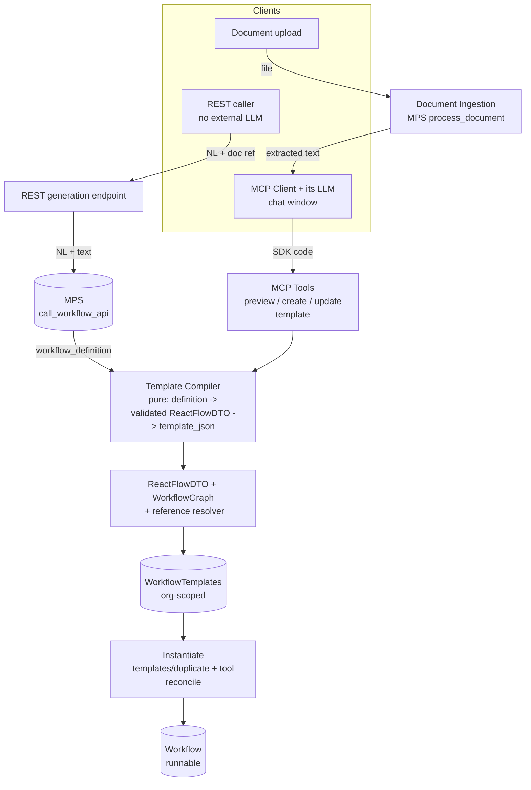
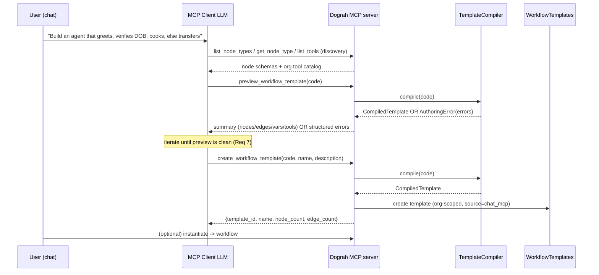
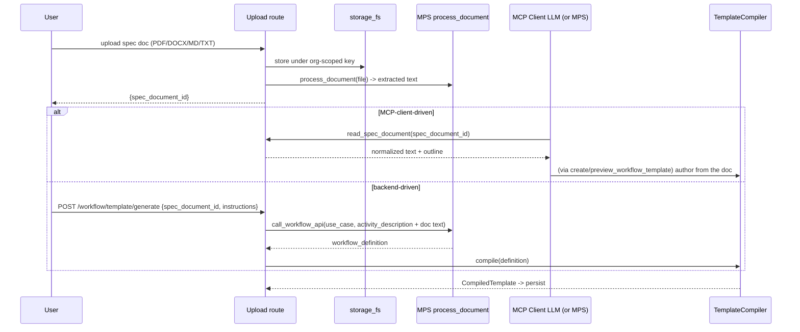

# Design — Conversational Workflow-Template Authoring

## Overview

This feature adds a **conversational and document-driven path to author reusable Samvaad workflow
templates**, on top of the existing workflow engine and MCP server. A user, from a chat client (or
a backend REST call), describes an agent in plain English or uploads a specification document; the
system reasons about that intent, assembles a **validated** `ReactFlowDTO`, and persists it as an
**org-scoped `WorkflowTemplates` entry** that can be instantiated into a runnable workflow.

The design is deliberately thin: the reasoning ("figure out what the workflow looks like") is done
by an **LLM outside this repo** — either the MCP client's LLM (the chat window) or the Model Proxy
Service (MPS). This repo's job is to (a) expose the authoring catalog, (b) accept a candidate
definition, (c) **compile + validate** it into a template using the exact same gates that guard
hand-built workflows, and (d) persist and instantiate it tenant-safely.

Two authoring surfaces, one compiler:



Design goals:

- **Reuse, don't fork** — every generated agent is a `ReactFlowDTO` validated by `WorkflowGraph`
  (Req 5, 12). Storage is `WorkflowTemplates`; instantiation is the existing duplicate path (Req 8).
- **One compiler, two seams** — the MCP-client path and the MPS path converge on the same
  `TemplateCompiler.compile(...)` (Req 4).
- **Pure core** — compilation, reference resolution, and validation orchestration are
  side-effect-free functions, wired into MCP tools/routes afterward (Req 4.4, 12.4).
- **Tenant isolation is a hard boundary** — org resolved from the authenticated principal; every
  reference validated against the caller's org (Req 6, 9, 11).

Non-goals: no in-repo chat LLM, no runtime change, no visual-editor replacement, no MPS wire-format
definition (external contract).

## Architecture

### Package layout

A new service package `api/services/workflow_authoring/` holds the pure core; MCP tools live under
`api/mcp_server/tools/`; the REST endpoint extends `api/routes/workflow.py`; storage changes live in
`api/db/`.

```
api/services/workflow_authoring/
├── compiler.py          # TemplateCompiler: candidate definition -> validated ReactFlowDTO -> template_json
├── references.py        # Logical tool refs + org-scoped reference validation/reconciliation
├── document_intake.py   # Orchestrates upload -> MPS process_document -> normalized text (thin)
├── errors.py            # AuthoringError / error_code taxonomy (mirrors create_workflow codes)
└── analytics.py         # event helpers (thin wrapper over posthog_client)

api/mcp_server/tools/
├── template_authoring.py   # preview_workflow_template, create_workflow_template, update_workflow_template
└── spec_documents.py       # list_spec_documents, read_spec_document (extracted text for the client LLM)

api/routes/
└── workflow.py             # + POST /workflow/template/generate (backend/MPS path), + upload route

api/db/
├── models.py                       # WorkflowTemplates gains organization_id (nullable)
├── workflow_template_client.py     # org-scoped create/get/list/update/delete
└── alembic/versions/...            # migration: add organization_id + index
```

### Component responsibilities

| Component | Responsibility | Reuses |
|---|---|---|
| `TemplateCompiler` | Turn a candidate definition into a validated `ReactFlowDTO`, then `template_json`. Pure. | `ReactFlowDTO`, `WorkflowGraph`, `ts_bridge.parse_code` (for SDK code input), `sanitize_workflow_definition` |
| `references.py` | Extract/resolve/validate tool/document/credential/recording refs against the caller's org; convert to/from logical tool names. | `db_client` catalog lookups, switchboard enablement pattern |
| `document_intake.py` | Upload → storage → `mps_service_key_client.process_document` → normalized text; org-scoped keys. | `storage_fs`, MPS client, KB ingestion pattern |
| MCP `template_authoring` tools | Conversational surface: preview (dry-run), create, update. Auth + org from API key. | `authenticate_mcp_request`, `traced_tool`, `TemplateCompiler` |
| MCP `spec_documents` tools | Let the client LLM read a previously-uploaded doc's extracted text. | `document_intake`, `db_client` |
| REST `POST /workflow/template/generate` | Backend/MPS seam: NL + optional doc ref → MPS → compile → persist. | `mps_service_key_client.call_workflow_api`, `get_user`, `TemplateCompiler` |
| `WorkflowTemplateClient` (extended) | Org-scoped template CRUD. | existing client |

## Data models

### Candidate definition (input to the compiler)

The compiler accepts one of two input shapes and normalizes both to a `ReactFlowDTO`:

- **SDK code** (MCP client path): a TypeScript string using `@dograh/sdk`, parsed by the existing
  `ts_bridge.parse_code` into a `{nodes, edges}` payload — exactly as `create_workflow` does today.
- **Definition dict** (MPS path): a `{nodes, edges}` JSON object returned by MPS, sanitized via
  `sanitize_workflow_definition` before validation.

Both converge on:

```python
# api/services/workflow_authoring/compiler.py  (shape, illustrative)
@dataclass(frozen=True)
class CompiledTemplate:
    dto: ReactFlowDTO            # validated
    template_json: dict          # dto.model_dump(mode="json")
    node_count: int
    edge_count: int
    required_variables: set[str] # WorkflowGraph.get_required_template_variables()
    logical_tool_refs: set[str]  # tool names referenced by nodes
```

`TemplateCompiler.compile(candidate) -> CompiledTemplate` raises `AuthoringError(error_code, ...)`
on any validation failure. It performs **no** DB/network/storage I/O.

### Workflow Template — org scoping (schema change)

`WorkflowTemplates` gains a nullable `organization_id`:

```python
class WorkflowTemplates(Base):
    __tablename__ = "workflow_templates"
    id = Column(Integer, primary_key=True, index=True)
    template_name = Column(String, nullable=False, index=True)
    template_description = Column(String, nullable=False, index=True)
    template_json = Column(JSON, nullable=False, default=dict)
    organization_id = Column(                      # NEW
        Integer, ForeignKey("organizations.id", ondelete="CASCADE"), nullable=True
    )
    source = Column(String, nullable=True)         # NEW: builtin | chat_mcp | document | mps_rest
    created_by = Column(Integer, ForeignKey("users.id"), nullable=True)  # NEW (audit)
    created_at = Column(DateTime(timezone=True), default=lambda: datetime.now(UTC))
    __table_args__ = (
        Index("ix_workflow_templates_org_id", "organization_id"),
    )
```

- `organization_id IS NULL` ⇒ a **built-in/global** template (e.g. `spinsci-switchboard`) — existing
  rows keep working unchanged (Req 9.2).
- `organization_id = <org>` ⇒ an **org-owned generated** template.
- Listing returns `organization_id IS NULL OR organization_id = :caller_org` (Req 9.3).
- Read/update/delete of a row owned by another org → 404 (Req 9.4).

`template_name` uniqueness: the switchboard registrar looks up by name globally
(`get_workflow_template_by_name`). To avoid collisions between org-owned templates, generated
templates are keyed by `(organization_id, template_name)`; the built-in lookup path is preserved by
filtering on `organization_id IS NULL`.

### Logical tool references

Inside `template_json`, node `tool_uuids` for generated templates hold **logical names**, not org
`tool_uuid`s — the same convention the switchboard uses (`PATIENT_LOOKUP.name`). This keeps a
template portable across orgs. At instantiation, `references.reconcile_tool_refs(template_json,
org_id)` maps each logical name to a concrete org `tool_uuid`:

- If a tool with that name exists in the org catalog → use its `tool_uuid`.
- If a provisioning contract exists for that logical tool → provision it (as switchboard
  enablement does) and use the new `tool_uuid`.
- Otherwise → fail instantiation with a clear, itemized error (Req 6.5).

For **direct** references (a definition that already carries concrete uuids), `references
.validate_org_ownership(definition, org_id)` asserts every `tool_uuid`/`document_uuid`/
`recording_id`/`credential_uuid` belongs to the caller's org, rejecting cross-tenant references
(Req 6.2).

## Key flows

### Flow A — chat NL → template (MCP client path, primary)



The reasoning is the client LLM's; the backend only compiles, validates, and persists. This is the
"build the complete agent workflow using chat" surface (Req 1, 2, 7).

### Flow B — document upload → template



Document text is **untrusted** and only ever used as authoring input; it never changes system
behavior or authorization (Req 3.5, 11.3).

### Flow C — instantiate template → workflow

Reuses `POST /workflow/templates/duplicate`. For generated (non-switchboard) templates the path is
extended to run `references.reconcile_tool_refs` before `create_workflow`, then regenerate trigger
UUIDs and sync triggers exactly as today (Req 8). The existing switchboard branch is untouched.

## Validation strategy

The compiler runs the identical gates that guard every workflow, in order, short-circuiting to a
structured error on the first failing stage:

1. **Parse** (SDK-code input only): `ts_bridge.parse_code` → `{nodes, edges}` (`error_code:
   parse_error | validation_error`).
2. **Sanitize** (dict input): `sanitize_workflow_definition` strips UI-only fields.
3. **Schema**: `ReactFlowDTO.model_validate` → node/edge shape + referential integrity
   (`schema_validation`).
4. **Graph**: `WorkflowGraph(dto)` → single start node, ≤1 global node, edge cardinality
   (`graph_validation`).
5. **References**: `references.validate_org_ownership` for any direct uuids; logical tool names
   recorded for instantiation (`reference_error`).
6. **Size/limits**: node/edge count + payload bytes bounds (`too_large`).

Only after all stages pass does the tool/route persist. This mirrors `create_workflow`'s error
contract so the client LLM can self-correct (Req 1.4, 5, 10.1).

## MCP tool contracts (new)

- `preview_workflow_template(code: str) -> {ok, summary?, error_code?, errors?}` — dry-run; no side
  effects (Req 2).
- `create_workflow_template(code: str, name: str, description: str) -> {created, template_id?,
  error_code?, error?}` — compile + persist org-scoped (Req 1).
- `update_workflow_template(template_id: int, code: str) -> {updated, error_code?}` — full-replace
  an org-owned template (Req 7.2). 404 for other orgs (Req 9.4).
- `list_spec_documents() -> [{spec_document_id, filename, status}]` and
  `read_spec_document(spec_document_id: int) -> {text, outline?}` — expose extracted document text
  to the client LLM (Req 3.3).

All authenticate via `authenticate_mcp_request()` and wrap with `traced_tool`; org is taken from the
API key (Req 1.5, 11.1). Tool docstrings are the LLM-facing contract and must document every
`error_code` (kept in sync by an instructions-drift test, like `create_workflow`).

## REST contracts (new / extended)

- `POST /workflow/spec-documents/upload` (or presigned-URL variant matching the ambient-noise
  pattern) — upload a spec doc; returns `spec_document_id`. Enforces size + MIME allowlist; stores
  under `spec-documents/{org_id}/{uuid}_{name}` (Req 3.1, 11.4).
- `POST /workflow/template/generate` — body `{instructions?, spec_document_id?, call_type}`; invokes
  MPS, compiles, persists template; returns the template response shape (Req 4.5).
- Template listing (`GET /workflow/templates`) — filtered to global + caller-org templates (Req 9.3).

## Security & multi-tenant isolation

- **Auth & org resolution**: MCP tools use `authenticate_mcp_request()`; REST uses `get_user`. Org
  comes from the principal, never the request body (Req 11.1).
- **Reference isolation**: every direct resource reference is validated against the caller's org at
  the query level; logical tool names are only ever reconciled within the caller's org (Req 6.2,
  11.2).
- **Untrusted input**: NL and document content are confined to producing a definition. The compiler
  never executes content; the client LLM is instructed (via tool docstrings/instructions) to treat
  document text as data, and generated definitions cannot introduce engine behavior beyond the node
  schema (Req 3.5, 11.3).
- **Network-exposed capabilities**: creating an HTTP/webhook tool from a document requires explicit
  confirmation and URL validation; secrets are referenced via credentials, never inlined; masking
  applies to `template_json` (Req 6.3, 6.4, 11.5).
- **Uploads**: size cap + MIME allowlist; org-scoped storage keys (Req 11.4).

## Migration

Additive Alembic migration:

1. `ALTER TABLE workflow_templates ADD COLUMN organization_id INTEGER NULL REFERENCES
   organizations(id) ON DELETE CASCADE`.
2. `ADD COLUMN source VARCHAR NULL`, `ADD COLUMN created_by INTEGER NULL REFERENCES users(id)`.
3. `CREATE INDEX ix_workflow_templates_org_id ON workflow_templates(organization_id)`.

Existing rows get `organization_id = NULL` (built-in/global), preserving current behavior including
the switchboard registrar's global name lookup. Reversible `downgrade()` drops the columns/index.
This is additive and backward-compatible; flag it as a schema change requiring review before apply.

## Testing strategy

- **Compiler (pure, unit + property)** — golden cases: valid multi-node definition compiles;
  missing start node, two start nodes, two global nodes, dangling edge, unknown node type, unknown
  field each raise the correct `error_code`. Property test: any definition the compiler accepts also
  passes a fresh `WorkflowGraph`, and `required_variables`/`logical_tool_refs` are consistent with
  the graph. (Aligns with the property-based-testing and TDD practices.)
- **Reference resolver** — org-ownership validation rejects cross-tenant uuids; logical-name
  reconciliation resolves existing tools, provisions where a contract exists, and fails clearly when
  unresolved.
- **MCP tools** — preview is side-effect-free; create persists org-scoped; update on another org's
  template returns not-found; error contract matches docstring (drift test).
- **Document intake** — MIME/size rejection; conversion failure yields no partial template; extracted
  text is exposed read-only.
- **Routes** — generate endpoint compiles MPS output and rejects invalid definitions; template
  listing returns global + caller-org only; instantiation reconciles tool refs and passes
  publish-time validation.
- **Smoke** — a generated template instantiates into a workflow that constructs and validates via
  `WorkflowGraph` (mirrors the switchboard smoke test).

Tests source `api/.env.test` and hit the test DB per project conventions.

## Open questions / external contracts

1. **MPS contract for document-aware generation** — does `call_workflow_api` accept extracted
   document text / a template-output mode, or is a new MPS endpoint needed? Treated as an external
   contract; the backend passes NL + document text and compiles whatever definition MPS returns.
2. **Tool provisioning contract** — for logical tools that don't exist in an org, is there a generic
   provisioning path (beyond the switchboard's bespoke one)? Until one exists, instantiation fails
   with an itemized "missing tool" error rather than silently dropping the reference.
3. **Template versioning** — templates are currently single-row (no version history). Out of scope
   here; refinement full-replaces the row. Revisit if version history is required.

## Traceability

| Requirement | Design element |
|---|---|
| 1 MCP create | `create_workflow_template` tool → `TemplateCompiler` → org-scoped persist |
| 2 Preview | `preview_workflow_template` tool (side-effect-free) |
| 3 Document authoring | upload route + `document_intake` (MPS) + `read_spec_document` tool |
| 4 Generation core | `TemplateCompiler` (pure) + `POST /workflow/template/generate` |
| 5 Validation gate | compiler stages 3–4: `ReactFlowDTO` + `WorkflowGraph` |
| 6 Reference resolution | `references.py` (validate + reconcile logical tool refs) |
| 7 Refinement | preview loop + `update_workflow_template` |
| 8 Instantiation | extended `templates/duplicate` + `reconcile_tool_refs` |
| 9 Org scoping | `WorkflowTemplates.organization_id` + filtered listing |
| 10 Limits/observability | compiler size gate + analytics events + structured logs |
| 11 Security/tenancy | auth + org resolution + reference isolation + upload constraints |
| 12 Engine primitives | `ReactFlowDTO`-only, `WorkflowTemplates` reuse, pure core |
