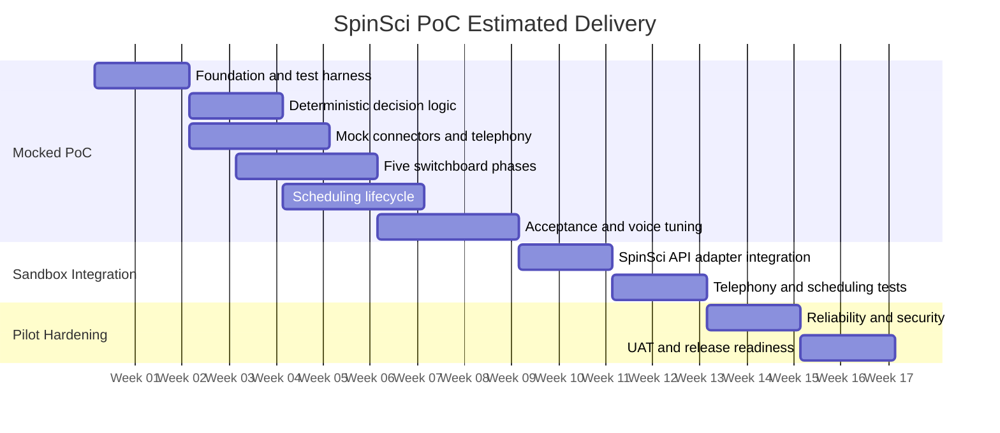

# SpinSci Switchboard and Scheduling PoC — Development Estimate

| Version | 1.0 |
|---|---|
| **Date** | 2025-01-27 |
| **Estimate type** | Calendar timeline with split delivery stages |
| **Confidence** | ROM, medium confidence, approximately ±20% |
| **Team** | 3 full-time dedicated engineers |

---

## Tech stack

| Layer | Technology | Role in this PoC |
|---|---|---|
| **Language** | Python ≥ 3.12 | All backend, decision logic, tests |
| **API framework** | FastAPI (async) | HTTP endpoints, webhook handlers |
| **Voice runtime** | Pipecat (in-repo, vendored) | STT → LLM → TTS pipeline, turn management |
| **Workflow engine** | Dograh/Samvaad graph engine (`api/services/workflow/`) | Validated node/edge graph, context variables, tool scoping |
| **LLM** | OpenAI / Anthropic / Google (provider-agnostic via Pipecat) | Dialogue generation, intent classification |
| **STT** | Deepgram / provider-agnostic via Pipecat | Real-time speech-to-text |
| **TTS** | ElevenLabs / Cartesia / provider-agnostic via Pipecat | Text-to-speech with verbatim script fidelity |
| **Telephony** | Twilio / Vonage / Vobiz / ARI (provider-neutral abstraction) | Inbound call handling, transfer, hangup |
| **Database** | PostgreSQL + SQLAlchemy (async) | Workflow definitions, runs, organizations, credentials |
| **Migrations** | Alembic | Schema evolution |
| **Cache / Queue** | Redis + ARQ | Background tasks, worker sync, transfer correlation |
| **Storage** | MinIO (S3-compatible) | Audio recordings, greeting assets |
| **Testing** | pytest + Hypothesis | Unit, property-based (33 properties), integration, E2E scenarios |
| **Logging** | Loguru | Structured logging throughout |
| **Configuration** | Environment variables via `api/constants.py` | Schedules, hotwords, credentials, feature flags |
| **Integrations** | Self-registering packages (`api/services/integrations/`) | SpinSci backend connectors as custom/MCP workflow tools |
| **Containerization** | Docker / docker-compose | Local dev services, deployment |

### SpinSci-specific additions (no new platform dependencies)

| Component | Implementation approach |
|---|---|
| Call State Ledger (23 fields) | Pydantic model mapped to workflow extraction/context variables |
| Business-hours evaluator | Pure function over `zoneinfo` (America/Chicago) |
| Verbatim scripts | String constants + `render_template` |
| 11 backend connector tools | Custom HTTP workflow tools behind `ToolModel`, node-scoped via `tool_uuids` |
| Scheduling Init | Downstream agent node segment within the same graph |
| Scheduling Engine adapter | Custom tool invoking SpinSci's scheduling API (mocked until sandbox) |

---

## Contents

1. [Summary](#summary)
2. [Estimate table](#estimate-table)
3. [Calendar plan](#calendar-plan)
4. [Research findings — platform reuse](#research-findings--platform-reuse)
5. [Scope by delivery stage](#scope-by-delivery-stage)
6. [Team allocation](#team-allocation)
7. [Proposed design](#proposed-design)
8. [Task breakdown](#task-breakdown)
9. [Major assumptions](#major-assumptions)
10. [Estimate risks](#estimate-risks)

---

## Summary

**Problem statement:** Build an inbound healthcare switchboard on the existing Dograh workflow
engine. It must support business/after-hours handling, authentication and routing guardrails,
exact caller scripts, telephony transfer/hangup, and five scheduling actions (create, cancel,
reschedule, list, confirm).

The estimate treats SpinSci workflows, prompts, and API material as **partially available** but
requiring validation and completion. SpinSci contracts, sandbox access, and responsive technical
support are assumed available before sandbox integration begins.

---

## Estimate table

| Delivery stage | Incremental duration | Cumulative duration | Outcome |
|---|---:|---:|---|
| Mocked, acceptance-ready PoC | **8–10 weeks** | **8–10 weeks** | Complete workflow using mocked SpinSci services |
| SpinSci sandbox integration | **3–4 weeks** | **11–14 weeks** | Real sandbox APIs and telephony transfer tested |
| Pilot hardening | **3–4 weeks** | **14–18 weeks** | Operationally controlled pilot release |
| Minimal operator configuration | **+1–2 weeks** | Can partly overlap | Existing-platform configuration for schedules, mappings, scripts, and credentials |
| Dedicated admin/product surface | **+5–8 weeks** with a frontend engineer | Separate option | Admin UI, reporting, deployment support, and documentation |

**Recommended project commitment:** plan for **16 calendar weeks**, with a **14–18 week
confidence range** for the core pilot.

- The mocked PoC can be demonstrated after approximately **week 9**.
- Sandbox readiness is expected around **week 13**.
- Pilot readiness around **week 16**.

---

## Calendar plan



*Dates in the diagram are illustrative; the controlling estimate is the week range.*

---

## Research findings — platform reuse

### Strong reuse (minimal new work)

| Platform capability | Reuse maturity |
|---|---|
| Validated workflow nodes and edges | High |
| Per-call extraction/context variables | High |
| Node-scoped tools (gate-by-scoping) | High |
| Silent and fixed-speech transitions | High |
| Pipecat STT → LLM → TTS runtime | High |
| Inbound telephony handling | High |
| Provider-neutral transfer support | Medium-High |
| Async workflow and Pipecat test fixtures | Medium |
| Integration registration and custom/MCP tools | High |

### Not yet implemented (SpinSci-specific work)

- Typed SpinSci Call State Ledger (23 fields)
- Chicago business-hours and after-hours decision logic
- Authentication and routing policy
- Verbatim SpinSci script assets (Appendix C/E)
- SpinSci backend connectors (11 tools)
- Scheduling Init and visit-type resolution
- Appointment create/cancel/reschedule/list/confirm behavior
- Provider availability and slot handling
- SpinSci acceptance-scenario harness (22 AC + 18 scenario variants)
- Configured after-hours hotword catalog

### Noted gap

A provider-neutral transfer abstraction exists. Hangup is less uniformly abstracted, so the
implementation must confirm or introduce the appropriate provider-level hangup seam without
creating a SpinSci-specific telephony fork.

---

## Scope by delivery stage

### Stage 1 — Mocked PoC (8–10 weeks)

**Included:**

- All five switchboard phases (Greeting, Business Hours, After Hours, Authentication, Routing)
- 23-field Call State Ledger
- Chicago business-hours evaluation with DST handling
- Exact mandatory scripts (Appendix C/E)
- Greeting and silent ANI lookup behavior
- Business-hours and after-hours paths
- Authentication gates (auth matrix, silent transitions, gate-by-scoping)
- Sequential silent routing
- Mocked patient, directory, identity, routing, and scheduling services
- Mocked transfer and hangup
- All five appointment actions (create, cancel, reschedule, list, confirm)
- Scheduling Init and visit-type resolution (sick vs. wellness)
- Provider availability and alternative-provider simulation
- Workflow graph validation
- Deterministic/property tests (33 correctness properties)
- All 22 acceptance criteria (AC-01 through AC-22)
- All 18 scenario variants (POC-01 through POC-16 including POC-01b and POC-01c)

**Not included:**

- Real SpinSci API calls
- Live carrier transfer
- Production deployment or support model
- Dedicated admin UI
- Production load or failover testing

### Stage 2 — Sandbox integration (additional 3–4 weeks)

**Included:**

- Map switchboard-side contracts to SpinSci sandbox schemas
- Authentication and credential integration
- Patient and directory API integration
- Identity/DOB validation integration
- Sequential routing APIs
- Scheduling Engine integration for all five actions
- Real sandbox transfer/hangup
- Timeouts, retries, schema validation, and error mapping
- Integrated acceptance regression
- Joint defect resolution with SpinSci

*The estimate assumes the mocked connector contracts remain stable and only their external
adapters change.*

### Stage 3 — Pilot hardening (additional 3–4 weeks)

**Included:**

- Operational error handling
- Structured diagnostics and correlation IDs
- Secret and credential validation
- Tenant-scoped configuration validation
- Transfer and scheduling failure recovery
- API timeout and retry policy
- Regression and concurrency testing
- Pilot deployment configuration
- Operational runbook
- UAT support and release sign-off

**Excluded unless separately requested:**

- Formal HIPAA certification or legal compliance review
- Production SLA or 24/7 support staffing
- Large-scale load testing beyond agreed pilot volumes
- Disaster recovery design
- New telephony provider implementation

### Optional — Operator and product surfaces

| Surface | Estimate | Dependency |
|---|---|---|
| Minimal operator configuration (schedule, scripts, mappings, credentials) via existing platform | +1–2 weeks | Can overlap with Stage 2/3 |
| Dedicated admin UI, reporting, deployment automation, and documentation | +5–8 weeks | Requires a frontend engineer |

---

## Team allocation

### Backend/voice engineer

**Primary ownership:**

- Ledger and decision logic
- Workflow graph construction
- Pipecat behavior
- Silent-transition and exact-speech controls
- Authentication/routing gates
- Scheduling dialogue
- Voice tuning and runtime defects

### Integration engineer

**Primary ownership:**

- Mock service contracts
- SpinSci API adapters
- Credentials and configuration
- Routing and scheduling connectors
- Transfer/hangup integration
- Timeout, retry, and error mapping

### QA engineer

**Primary ownership:**

- Acceptance traceability
- Property and scenario test harnesses
- 18 end-to-end variants
- Speech transcript assertions
- Sandbox regression
- Pilot UAT and release validation

*QA starts in week 1; it is not deferred until the end.*

---

## Proposed design

The SpinSci application remains a customer-specific service package built on the existing engine:

```
Inbound telephony
    |
Pipecat runtime
    |
Validated workflow graph
    |-- Greeting
    |-- Business Hours / After Hours
    |-- Authentication
    |-- Routing
    '-- Scheduling Init
             |
       Scheduling Engine adapter
```

The central control mechanism is **gate-by-tool-scoping:**

- Authentication nodes can validate identity but cannot transfer.
- Routing tools are unavailable before Routing.
- Transfer is available only on terminal Routing paths.
- New-patient and Records exceptions are explicit graph edges.
- Exact speech resides in immutable script assets and transition speech.
- Deterministic policy is implemented as pure functions, not left solely to prompts.

SpinSci wire formats remain behind adapters. The core workflow operates on the platform-owned
ledger and connector contracts so sandbox integration does not require redesigning the
conversation.

---

## Task breakdown

### Task 1: Validate reusable assets and establish the executable foundation

**Objective:** Convert partially available SpinSci prompts, workflows, and contracts into a
validated baseline and establish the Call State Ledger, schedule configuration, script catalog,
and test harness.

**Implementation guidance:** Inventory each provided artifact, assign reuse status, define the
23 ledger fields, configure the America/Chicago schedule, load hotwords from configuration, and
capture Appendix C/E wording verbatim. Keep logic in `api/services/switchboard/` and tests in
`api/tests/switchboard/`.

**Test requirements:** Write failing tests first for ledger validation, schedule boundaries, DST
behavior, script fidelity, and hotword configuration. Add a traceability map for AC-01 through
AC-22 and all scenario variants.

**Demo:** Construct a ledger, classify a call as open or closed, select the exact greeting, and
show that mandatory scripts match the vendor source.

---

### Task 2: Deliver deterministic conversation and gate decisions

**Objective:** Implement the pure rules needed by every workflow phase before introducing live
graph execution.

**Implementation guidance:** Add greeting selection, never-re-ask behavior, appointment-action
classification, authentication requirements, retry state machines, routing mode selection, phone
read-back formatting, visit-type resolution, and scheduling payload construction.

**Test requirements:** Use test-driven development for each rule. Add property-based tests for
schedule evaluation, ledger preservation, field collection, auth gating, routing sequencing,
script rendering, phone formatting, and scheduling invariants.

**Demo:** Feed representative ledgers and caller-intent tags through the decision layer and
display the correct next phase, required action, script, and scheduling payload without invoking
an LLM.

---

### Task 3: Deliver mocked connectors as an integrated tool layer

**Objective:** Expose every backend capability through node-scoped workflow tools using stable
internal contracts and deterministic mocks.

**Implementation guidance:** Implement mocked patient lookup, directory, FAQ, DOB validation,
identity verification, route listing, route metadata, transfer, hangup, scheduling handoff, and
Scheduling Engine tools. Preserve sequential routing and organization-scoped configuration.
Resolve telephony through the existing registry/factory.

**Test requirements:** Add contract tests for successful, empty, timeout, malformed, and failure
responses. Verify transfer payload contents and that routing metadata receives only an exact
value previously returned by route listing.

**Demo:** Run a mocked patient lookup, identity check, route resolution, transfer, and
scheduling call through the same interfaces later used by the sandbox adapters.

---

### Task 4: Deliver the Greeting, Business Hours, and After Hours graph

**Objective:** Build the caller-facing entry and intent-handling phases as a valid, runnable
workflow increment.

**Implementation guidance:** Implement silent ANI lookup, configured welcome audio,
personalization, Path A acknowledgment, directory and FAQ behavior, appointment-action
classification, new/existing handling, after-hours restrictions, paging clarification, hotword
escalation, closed departments, and retry exhaustion.

**Test requirements:** Add graph tests that assert silent first turn, exact speech, same-turn
lookup rules, correct hours branch, no repeated known fields, Records bypass, and after-hours
restrictions.

**Demo:** Run mocked inbound calls through Greeting into Business Hours or After Hours,
including personalized, Records, scheduling, paging, and urgent-hotword examples.

---

### Task 5: Deliver Authentication, Routing, and terminal behavior

**Objective:** Complete protected routing with structurally enforced authentication and exact
terminal speech.

**Implementation guidance:** Build phone, DOB, identity, refusal, changed-request, and
failed-attempt paths. Scope route resolution and transfer tools only to Routing nodes. Keep
routing silent and terminal speech limited to the selected Appendix E line.

**Test requirements:** Verify no protected route or transfer can execute before authentication
resolves. Test auth refusal, changed intent, ANI reuse, routing sequence, exact transfer speech,
transfer failure, and hangup behavior.

**Demo:** Show a protected call moving through authentication and transfer, a Records call
bypassing authentication, an auth refusal still connecting, and a changed request returning to
intent handling.

---

### Task 6: Deliver all five scheduling actions

**Objective:** Integrate Scheduling Init and the mocked Scheduling Engine into the completed
switchboard.

**Implementation guidance:** For create, classify sick versus wellness and handle ambiguity
before slot lookup. For cancel, reschedule, list, and confirm, skip new/existing and visit type
but retain authentication and specialty requirements. Simulate availability, alternative
providers, urgency escalation, and inactive-specialty fallback.

**Test requirements:** Add tests for payload completeness, known-reason reuse,
wellness/symptom disambiguation, alternative providers, slot presentation, and every management
action.

**Demo:** Complete mocked create, cancel, reschedule, list, and confirm calls through one
continuous conversation.

---

### Task 7: Assemble and accept the mocked PoC

**Objective:** Wire every completed component into one validated graph and prove the
vendor-defined acceptance scope.

**Implementation guidance:** Assemble the five phase clusters and scheduling segment, configure
all tool references, validate graph invariants, and add transcript/event assertions for silence
and exact speech.

**Test requirements:** Execute all 22 acceptance criteria and all 18 scenario variants. Capture
failures against requirement IDs and run the full targeted regression suite.

**Demo:** Present the complete mocked PoC, including business-hours, after-hours, urgent,
Records, authentication, routing, and all scheduling scenarios.

---

### Task 8: Replace mocks with SpinSci sandbox adapters

**Objective:** Preserve the accepted conversation while integrating real SpinSci sandbox
services and telephony.

**Implementation guidance:** Map sandbox schemas to stable internal contracts, configure
credentials securely, validate responses, add timeout/retry behavior, and integrate patient,
directory, routing, identity, scheduling, transfer, and hangup APIs.

**Test requirements:** Run connector contract tests against sandbox fixtures, then repeat the
acceptance suite using the sandbox. Add negative tests for authorization, malformed responses,
unavailable services, and transfer failures.

**Demo:** Execute agreed end-to-end scenarios against SpinSci sandbox systems with real route
and appointment data.

---

### Task 9: Harden and release the pilot

**Objective:** Turn the sandbox-integrated system into a controlled, observable pilot increment.

**Implementation guidance:** Add production configuration validation, correlation and diagnostic
logging, failure recovery, operational metrics, deployment settings, runbooks, and pilot support
procedures. Preserve tenant isolation and avoid logging sensitive values.

**Test requirements:** Run regression, concurrency, recovery, credential-isolation,
failure-injection, and UAT tests. Establish release entry/exit criteria.

**Demo:** Deploy the pilot candidate, execute a release smoke suite, demonstrate operational
diagnostics, and complete the agreed UAT checklist.

---

### Task 10: Add optional operator and product surfaces

**Objective:** Layer operator configuration or a dedicated product UI onto the proven pilot
without changing workflow semantics.

**Implementation guidance:** First expose schedules, hotwords, scripts, specialty mappings, and
credentials through existing configuration mechanisms. If approved, add dedicated admin screens,
role-aware controls, reporting, deployment automation, and documentation.

**Test requirements:** Add validation, authorization, tenant-isolation, UI, and
configuration-propagation tests. Verify multi-worker configuration changes propagate through the
platform's synchronization mechanism.

**Demo:** An authorized operator changes a SpinSci configuration value, publishes it, and
verifies that subsequent calls use the updated configuration.

---

## Major assumptions

1. Existing Dograh workflow, Pipecat, inbound telephony, tool, and test infrastructure remains
   usable without an engine fork.
2. Partially available SpinSci assets save effort, but must still be validated in Task 1.
3. SpinSci provides complete sandbox contracts, credentials, test data, specialty mappings,
   routing data, transfer destinations, and technical support before Task 8.
4. The after-hours hotword catalog is supplied before final hotword QA.
5. One existing telephony provider supports the required transfer model.
6. "Low-level telephony wiring" remains out of scope; adding a new carrier/provider requires a
   separate estimate.
7. Scheduling is implemented as a SpinSci adapter and conversation layer, not as a new
   healthcare scheduling system of record.
8. The PoC uses test patient data only.
9. Mandatory wording does not materially change after acceptance tests are authored.
10. Formal compliance certification is outside this estimate.

---

## Estimate risks

| Risk | Likely impact |
|---|---|
| Partially available workflows are not reusable | +1–2 weeks |
| API contracts change during integration | +1–3 weeks |
| Telephony provider needs a new transfer model | +2–4 weeks |
| Provider-neutral hangup requires broader engine work | +0.5–1.5 weeks |
| Scheduling Engine lacks stable sandbox behavior | +2–4 weeks |
| Hotword list or urgency rules arrive late | Blocks final acceptance for those paths |
| Exact-speech behavior is inconsistent across LLM/TTS providers | +1–2 weeks of runtime tuning |
| Dedicated frontend assigned to the existing backend engineer | Product-surface option increases to approx. 7–10 weeks |

---

## Confidence and contingency

This is a **ROM estimate with medium confidence**, approximately **±20%**.

The estimate already includes normal implementation and defect contingency. It does not include
elapsed waiting time for SpinSci access because the estimate assumes contracts, credentials,
sandbox availability, and responsive technical support are available before integration begins.

**Sensitivity:**

- If the partially available SpinSci prompts/workflows cannot be imported or reused, add
  **1–2 weeks**.
- If SpinSci API contracts materially change after sandbox work begins, add **1–3 weeks**,
  depending on the affected services.
