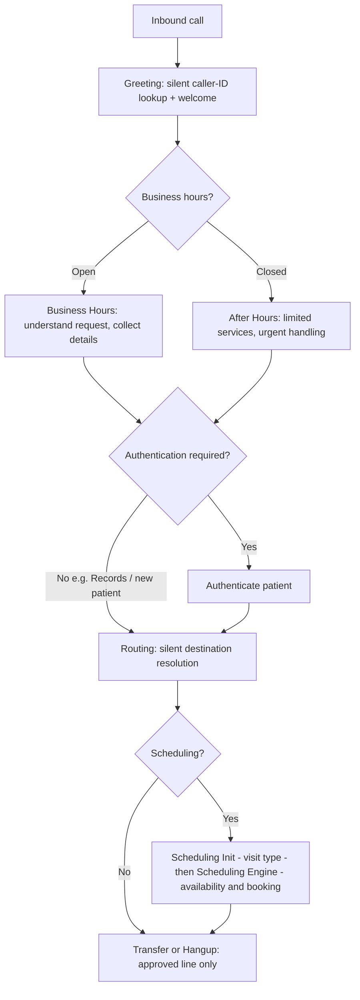

# SpinSci AI Virtual Switchboard — PoC Scope Overview

**Purpose of this document.** A single, high-level walkthrough of the PoC — *what* we're building
(requirements), *how* we'll build it (design), and *the plan* to deliver it (tasks). It is meant
for scoping and sign-off. Fine-grained detail lives in the working spec
(`requirements.md`, `design.md`, `tasks.md`) and is intentionally not repeated here.

**One-line summary.** An inbound AI phone switchboard for a healthcare provider network that
greets callers, decides business vs. after-hours handling, authenticates patients when required,
routes to the right destination, and manages appointments — speaking only approved scripts and
moving between internal steps invisibly.

---

## Contents

1. At a glance
2. Part 1 — Requirement Understanding
   - What the switchboard does
   - The rules that define "quality" here
   - Appointment management (in scope)
   - Boundaries & dependencies
3. Part 2 — Design Approach
   - The core decision: build on the workflow engine
   - How the requirements map onto the engine
   - The key design idea: gates enforced by construction
   - End-to-end flow (what callers experience)
   - Designing for quality and trust
4. Part 3 — Implementation Plan
   - Strategy: prove the hard rules first, then wire the conversation
   - Delivery phases
   - How we verify it works
   - Known dependencies & assumptions
5. Suggested talking points for the presentation

---

## At a glance

| | |
|---|---|
| **What** | Inbound voice switchboard + appointment management (create/cancel/reschedule/list/confirm) |
| **Not** | Outbound calling/campaigns; medical advice; low-level telephony wiring |
| **Built on** | The existing platform **workflow-graph engine**|
| **Caller experience** | One continuous conversation; internal phase changes are silent |
| **Success measure** | The 22 acceptance criteria and 16 end-to-end test scenarios pass |
| **External dependencies** | SpinSci backend API contracts; after-hours "hotword" keyword list (both provided by SpinSci) |

---

# Part 1 — Requirement Understanding

## What the switchboard does

Every call flows through five **conversation phases** that the caller never hears named:

```
Greeting  →  Business Hours  or  After Hours  →  Authentication (when required)  →  Routing  →  Transfer or Hangup
```

- **Greeting** — silent caller-ID lookup, a configured welcome message, and collect why they're calling.
- **Business / After Hours** — behavior branches on a Chicago-time schedule set at call start.
- **Authentication** — verify the patient (phone → date of birth → identity) before connecting, when the request requires it.
- **Routing** — silently resolve the correct destination and connect the caller.
- **Transfer / Hangup** — connect or end the call using only the approved spoken line.

All phases share one **Call State Ledger** — a running record of everything known about the call
(caller, intent, specialty, verification status, appointment details, etc.) — so the assistant
never asks for the same fact twice.

## The rules that define "quality" here

This is a **guardrail-heavy** system. The hard rules are what make it feel professional and
compliant:

- **Authenticate before connecting** for protected requests; never connect an unverified caller who should be verified.
- **Silent internal transitions** — the caller doesn't hear the system moving between steps.
- **Exact, approved wording** — mandatory caller lines must be spoken verbatim.
- **Clean handoffs** — during routing the assistant is silent; on transfer it speaks only the one prescribed line.
- **Never expose internals** — no system names, no technical jargon, no medication names read back.
- **Never re-ask** anything already known.

## Appointment management (in scope)

The switchboard recognizes five appointment actions and routes them correctly:

| Action | Caller intent | Needs auth? | Notes |
|---|---|---|---|
| **create** | Book a visit | If existing patient | Asks new vs. existing; new patients go to intake |
| **cancel** | Cancel a visit | Yes | Existing patient implied |
| **reschedule** | Move a visit | Yes | Existing patient implied |
| **list** | "What appointments do I have?" | Yes | Existing patient implied |
| **confirm** | "Confirm my appointment" | Yes | Existing patient implied |

Scheduling is a continuous experience for the caller but spans three layers internally:
**Switchboard** (collects specialty/provider/location, gates auth) → **Scheduling Init**
(determines sick vs. wellness visit) → **Scheduling Engine** (checks provider availability and
completes the booking).

## Boundaries & dependencies

- **In scope:** the five phases, shared state, business/after-hours logic, intent routing,
  authentication, approved scripts, and full appointment management.
- **Out of scope:** outbound campaigns, medical advice, and any deep edge-case matrices.
- **Provided by SpinSci (external):** exact backend API contracts (patient lookup, directory,
  identity, routing, scheduling) and the after-hours urgent-keyword list. We scaffold against
  mocks so the PoC is ready the moment these arrive.

---

# Part 2 — Design Approach

## The core decision: build on the workflow engine

We evaluated building a lightweight standalone pipeline versus using the workflow-graph
engine. **We chose the workflow engine** because this requirement is fundamentally a *controlled,
stateful state machine* — and the engine turns the hard rules into structure the AI can't easily
violate, rather than instructions we hope it follows. It also matches the direction for any future
expansion, so the PoC work is not throwaway.

## How the requirements map onto the engine

| Requirement concept | Engine mechanism |
|---|---|
| The 5 phases | Clusters of workflow **nodes** |
| Phase transitions | **Edges** with a condition |
| Silent transitions | Edges with no spoken line |
| Approved spoken lines | Fixed text on edges/nodes |
| Call State Ledger | Per-call **context variables** carried across the graph |
| Backend systems (lookup, identity, routing, scheduling, transfer) | **Tools** attached to specific nodes |

## The key design idea: gates enforced by construction

The most important design choice: **a node can only use the tools it's given.** The "transfer"
capability exists **only** in the Routing step, and Routing is only reachable after
Authentication (or an explicit, allowed skip such as Records). This means "don't connect before
verifying" is guaranteed by the structure of the graph — not left to the model's judgment. The
same technique enforces the other gates.

## End-to-end flow (what callers experience)



## Designing for quality and trust

- **Correctness properties.** We defined a set of formal "must always hold" rules (e.g. *never
  transfer before verification resolves*, *a terminal turn speaks only the prescribed line*, *a
  known fact is never re-asked*). These are verified automatically (see Part 3).
- **Deterministic core, separated from the AI.** The rule-based decisions (schedule, gating,
  routing sequence, script wording) are isolated so they can be tested exhaustively and behave the
  same every time.
- **External contracts stay external.** Backend integrations are wrapped as tools with clean
  boundaries; SpinSci's wire formats are not baked into our logic.
- **Traceability.** Every design element maps back to a specific requirement and vendor acceptance
  criterion.

---

# Part 3 — Implementation Plan

## Strategy: prove the hard rules first, then wire the conversation

We build and test the deterministic decision logic **before** assembling the live conversation.
This front-loads confidence in the guardrails (the parts that matter most for a healthcare
switchboard) and de-risks the PoC early.

## Delivery phases

| Phase | Focus | Outcome |
|---|---|---|
| **1. Foundation** | Call State Ledger, Chicago-time schedule, approved-script assets | Shared state + config in place, scripts captured verbatim |
| **2. Decision logic** | Greeting, hours, authentication, routing, scheduling rules as tested units | Every hard rule proven in isolation |
| **3. Connectors** | Backend tools (lookup, identity, routing, scheduling, transfer) with mocks | Integration points ready; telephony transfer/hangup wired |
| **4. Assemble the graph** | The five phase clusters, gate-by-scoping, validation | A complete, validated switchboard workflow |
| **5. Scheduling flow** | Scheduling Init + Engine downstream | Full appointment lifecycle |
| **6. Acceptance** | The 16 end-to-end vendor scenarios | Demonstrable, sign-off-ready PoC |

Checkpoints are built in between phases to confirm everything still passes before moving on.

## How we verify it works

- **Property-based testing** exhaustively checks each guardrail across many generated inputs — not
  just a few hand-picked examples.
- **End-to-end scenario tests** replay the vendor's 16 required call scenarios (POC-01…16).
- **Acceptance criteria** — the vendor's 22 criteria (AC-01…22) are the definition of done.

## Known dependencies & assumptions

- **Blocked on SpinSci (scaffolded with mocks now):** backend API contracts and the after-hours
  hotword keyword list. These do not block PoC construction; they block final live integration.
- **A few small requirement clarifications** are logged as open questions (e.g. Directory
  info-vs-connect behavior). None affect the overall scope.

---

## Suggested talking points for the presentation

1. **This is a controlled workflow, not a chatbot** — quality comes from structure, not prompting.
2. **Gates are enforced by design** — the system *cannot* connect a caller before verifying when verification is required.
3. **We build the guardrails first** — the riskiest, most compliance-sensitive logic is proven before the conversation is assembled.
4. **Ready for SpinSci's systems on arrival** — everything external is mocked behind clean boundaries.
5. **Sign-off is objective** — 22 acceptance criteria and 16 end-to-end scenarios define success.
