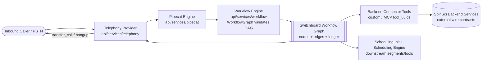
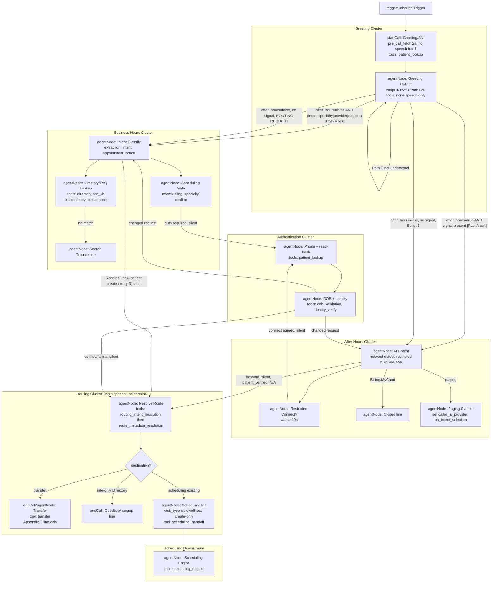
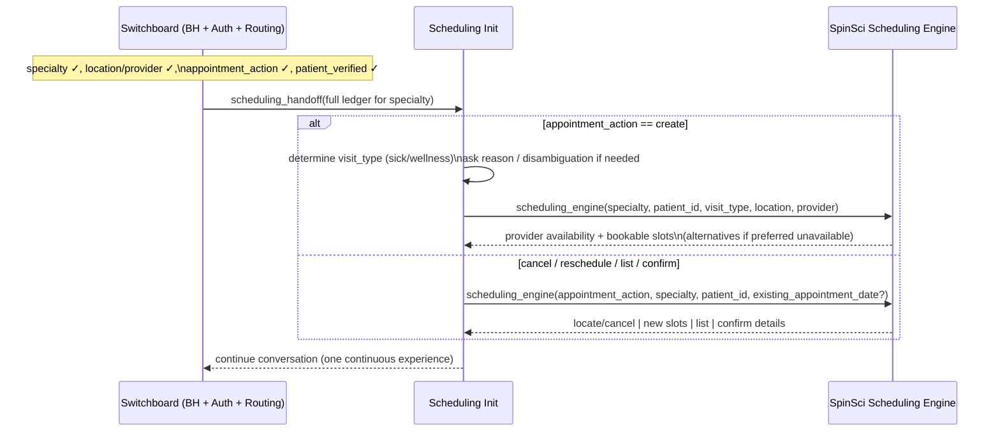

# Design Document

## Overview

This design specifies the **SpinSci AI Virtual Switchboard PoC** as a single validated
**Samvaad (Dograh) workflow graph** running on the repository's graph-based workflow engine
(`api/services/workflow/`), driven by the Pipecat engine (`api/services/pipecat/`) with the
telephony providers (`api/services/telephony/`) executing transfer and hangup. This is **not** a
bespoke pipeline and it is **not** built on bdr-calling: the switchboard is expressed entirely in
the engine's existing primitives — `startCall`, `trigger`, `agentNode`, `endCall`, `globalNode`
nodes, edges carrying `condition` + `transition_speech`, node-scoped `tool_uuids` /
`document_uuids` / `extraction_variables`, and `pre_call_fetch_*` on the entry node.

The five conversation phases (Greeting → Business Hours / After Hours → Authentication → Routing →
terminal transfer/hangup) become **node clusters** in one directed graph validated by
`WorkflowGraph`. The **Call State Ledger** (Appendix D) is the set of workflow
extraction/gathered-context variables threaded across every edge. **Silent turns** are agent nodes
that invoke backend tools but emit no speech and whose entering edge has empty `transition_speech`.
**Verbatim scripts** (Appendix C) live either as node prompts (spoken lines the node must produce
exactly) or as edge `transition_speech` (lines spoken on a transition). **Backend connectors**
(patient lookup, directory, FAQ/KB, DOB validation, identity verification, routing intent
resolution, route metadata resolution, transfer, hangup, scheduling handoff, Scheduling Engine)
are custom/MCP **workflow tools** referenced through node `tool_uuids`, and **per-node tool scoping
is the mechanism that enforces the gates** (e.g., the transfer tool exists only on Routing-cluster
nodes, so no transfer can physically occur before Routing).

The design is traceable to `requirements.md` (Requirements 1–21) and to the vendor identifiers
(`REQ-ARCH-*`, `REQ-SCHED-*`, `REQ-AUTH-01`, `REQ-ROUTE-*`, `REQ-LEDGER-*`, `GATE-*`, `AC-01..22`,
`POC-01..16`, Appendix B/C/D/E). Verbatim scripts (Appendix C/E) and the ledger field set
(Appendix D) are referenced, never rewritten. A full traceability matrix appears at the end, and
any surfaced gaps are captured under **Open Questions / Requirement Impacts** rather than changing
scope.

### Design goals and non-goals

- **Goal:** model the entire switchboard as one engine-validated graph reusing node/edge/tool
  primitives (Req 1), with one ledger carried in full across phases (Req 2), invisible phase
  transitions (Req 3), verbatim speech fidelity (Req 18), and gate enforcement by construction
  (Req 9, Req 10).
- **Goal:** keep SpinSci wire contracts external — connector tools declare input/output contracts
  but do not hardcode SpinSci's API schemas (Req 16.2).
- **Non-goal:** define SpinSci backend wire formats, the hotword keyword list (Req 21, TBD), or
  low-level telephony wiring beyond invoking the existing providers.
- **Non-goal / framing correction:** Requirement 19 — "Workflow-engine substrate and future
  extensibility (non-functional)" — now explicitly states that the Switchboard **is** built on the
  in-repo Samvaad/Dograh workflow engine (`api/services/workflow/`) and MUST NOT depend on any
  *external* Samvaad-integration pipeline beyond that in-repo engine, while staying behind the
  workflow-graph/tool boundaries for future extensibility. The design and the requirement are
  therefore aligned directly, not reinterpreted.

## Architecture

### System context

- **Telephony** accepts the inbound call and later executes `transfer_call(...)` / hangup on the
  active channel (`api/services/telephony/base.py` `transfer_call`; ARI `hangup_channel`).
- **Pipecat** drives turn-by-turn execution of the graph (STT → node prompt/LLM → tool calls →
  TTS / edge transition speech).
- **Workflow engine** validates the graph via `WorkflowGraph` (exactly one start node, ≤1 global
  node, per-type edge cardinality, referential integrity) and resolves template variables from the
  ledger via `get_required_template_variables()`.

### Phases as node clusters

Each phase is a `Node_Cluster`. The graph begins at an **inbound entry** (`trigger` →
`startCall`), never an outbound dial (Req 1.8). The Greeting `startCall` node owns the turn-1
`pre_call_fetch_*` ANI lookup (Req 6.1). Edges encode `condition` (transition rule) and
`transition_speech` (spoken line, empty for silent transitions).

### Turn / speech model

- **Silent turn:** an agent node whose prompt instructs "produce no spoken output; call
  `<tool>`; then transition", and whose *incoming* edge has `transition_speech = null/""`. Turn-1
  ANI lookup is a `startCall` with `pre_call_fetch_enabled=true` and no TTS (welcome audio is a
  separate config-driven asset, not node text) (Req 6.1, 6.4, AC-01, POC-07).
- **Verbatim spoken line on a transition:** the exact Appendix C/E string is stored in the edge
  `transition_speech` (with `transition_speech_type="text"`), e.g. Path A ack, transfer lines.
- **Verbatim spoken line owned by a node:** where the line is the node's whole job (e.g. "Billing
  closed", "Are you a new or existing patient?"), the exact text is the node prompt's mandated
  output; the global node's TTS-friendly persona (short sentences, no unpronounceable characters)
  reinforces Req 5.
- **Terminal turn:** transfer/hangup nodes speak **only** the Appendix E line and then invoke the
  transfer/hangup tool — no other node on that turn emits speech (GATE-TRANSFER-SPEECH, AC-08).

### After-hours evaluation (Req 17, REQ-ARCH-03)

`after_hours` is computed once at call start from the **America/Chicago** schedule
(Mon–Fri 08:00–17:00, Sat 08:00–12:00, Sun closed) and written to the ledger by the Greeting
`startCall` node (via pre-call fetch context or an initial-context injector). It stays authoritative
for the whole call **except** that the Business Hours cluster may correct a misroute to After Hours
by traversing a `ToAfterHours` correction edge. The evaluation is a pure function
`is_after_hours(dt_local) -> bool` so it is directly property-testable.

## Components and Interfaces

### Graph elements per cluster

| Cluster | Node types | Key node config | Scoped tools (`tool_uuids`) |
|---|---|---|---|
| Greeting | `trigger`, `startCall`, `agentNode` | `pre_call_fetch_*` on startCall (2s bound), `greeting_type=audio` for welcome, `extraction_variables` for `caller_name`,`intent` | `patient_lookup` |
| Business Hours | `agentNode` ×N | `extraction` for `intent`,`appointment_action`,`specialty`,`patient_status` | `directory_lookup`, `faq_kb`, (no transfer) |
| After Hours | `agentNode` ×N | hotword config ref, restricted INFORM/ASK prompts | `directory_lookup`, `faq_kb`, (no transfer) |
| Authentication | `agentNode` ×N | phone read-back format, DOB prompts | `patient_lookup`, `dob_validation`, `identity_verify` (no transfer) |
| Routing | `agentNode`, `endCall` | zero-speech resolution prompt; terminal Appendix E line | `routing_intent_resolution`, `route_metadata_resolution`, `transfer`, `hangup` |
| Scheduling (downstream) | `agentNode` | visit_type logic (Init), engine invocation | `scheduling_handoff`, `scheduling_engine` |

**Gate-by-scoping:** the `transfer` and `route_metadata_resolution` tools are attached **only** to
Routing-cluster nodes. Because a node can only invoke tools listed in its own `tool_uuids`, the
engine cannot transfer before the graph reaches Routing, and Routing is only reachable from
Authentication (for auth-required intents) or from the explicit auth-skip edges (Records,
new-patient create, retry-3, hotword). This makes GATE-AUTH (Req 9.2, POC-10) a structural
property, not a runtime check that could be bypassed.

### Global node (Req 4, Req 5)

A single `globalNode` carries the never-narrate-internals persona and TTS rules: never speak system
names/JSON/UUIDs/ledger field names (Req 4.1, AC-03); never repeat medication names (Req 4.2);
never name an unconfirmed clinical team (Req 4.3); use short sentences and periods between digit
groups (Req 5). Nodes that must emit an exact verbatim line set `add_global_prompt=false` where the
persona could otherwise perturb wording, protecting Appendix C/E fidelity (Req 18).

### Backend connector tools — input/output contracts

Each capability (Req 16.1) is a workflow tool (custom HTTP tool or MCP tool via `ToolModel`).
Contracts below are the **switchboard-side** shapes; SpinSci supplies the exact wire schema
externally (Req 16.2), so tools bind to a credential + endpoint and map fields, never hardcoding
SpinSci internals.

| Tool | Input (from ledger) | Output (to ledger) | Scoped to |
|---|---|---|---|
| `patient_lookup` | ANI or confirmed phone | `patient_id`, match count, name, DOB-on-file (opaque) | Greeting, Authentication |
| `directory_lookup` | specialty/provider/location query | `department_name`,`department_id`,`selected_id`, matches | Business/After Hours |
| `faq_kb` | question text | answer text | Business/After Hours |
| `dob_validation` | provided DOB, `patient_id` | match boolean | Authentication |
| `identity_verify` | `patient_id`, verification signals | `patient_verified` = Success/Fail | Authentication |
| `routing_intent_resolution` | department/intent context | **route listing** (list of exact routing-intent strings) | Routing |
| `route_metadata_resolution` | **exact** routing-intent string from listing | queue/destination metadata | Routing |
| `transfer` | destination, call summary, `patient_verified`, spoken transfer message | transfer result | Routing |
| `hangup` | goodbye line | — | Routing |
| `scheduling_handoff` | full ledger for `specialty` | Scheduling Init context | Scheduling |
| `scheduling_engine` | specialty, patient_id, appointment_action, visit_type (create), location/provider/existing_appointment_date | slots / appointment details / action result | Scheduling |

`transfer` executes through the telephony provider's `transfer_call(destination, ...)` and its
payload includes destination + call summary + verification status + spoken message (Req 16.3,
16.4). The **routing chain is sequential** (Req 10.2, 10.3): `routing_intent_resolution` completes,
then `route_metadata_resolution` is called with the **exact** returned string — never concurrent,
never fabricated (REQ-LEDGER-03).

## Data Models

### Call State Ledger → workflow context variables (Appendix D, Req 15)

The ledger is exactly one record per call (Req 2.1, REQ-ARCH-01), initialized in Greeting and
passed **in full** on every phase transition (Req 2.2). Each field is a workflow
extraction/gathered-context variable (Req 1.6). Types map to `VariableType` (`string`/`number`/
`boolean`).

| Ledger field | Type | Set in | Values / notes |
|---|---|---|---|
| `caller_name` | string | Greeting | from caller |
| `intent` | string | Greeting/Business Hours | internal intent label (≠ routing intent) |
| `patient_status` | string | Business Hours | null · new · existing |
| `provider_name` | string | Business/After Hours | |
| `specialty` | string | Business/After Hours | normalized when required (Req 15.2) |
| `scan_type` | string | Business Hours | MRI/CT · Mammo/Dexa · PET/Nuclear · US/Fluoro |
| `location` | string | Business Hours | city/address/site |
| `department_name` | string | directory lookup | |
| `department_id` | string | directory lookup | |
| `selected_id` | number | directory lookup | numeric record ID only (Req 15.3) |
| `patient_verified` | string | Authentication/After Hours | null · Success · Fail · N/A |
| `appointment_action` | string | Business Hours | create · cancel · reschedule · list · confirm |
| `existing_appointment_date` | string | Business Hours/caller | optional, cancel/reschedule |
| `visit_type` | string | **Scheduling Init only** | sick · wellness (create only) |
| `visit_reason` | string | Business Hours/Scheduling Init | derives visit_type |
| `preferred_provider_id` | string | caller/Engine | |
| `preferred_date` | string | caller | |
| `caller_is_provider` | boolean | After Hours paging | |
| `patient_id` | string | patient lookup | |
| `after_hours` | boolean | call start | America/Chicago schedule |
| `greeting_ani_lookup_done` | boolean | Greeting | turn-1 completion flag |
| `greeting_ani_match_count` | number | Greeting | ANI match count (personalized ⇔ ==1) |
| `ah_intent_selection` | string | After Hours | Hospital or Physician · Afterhours Answering Service |

**Never re-ask (REQ-LEDGER-01, Req 2.3, 15.4):** each collection node's prompt is guarded by a
condition on the corresponding ledger variable — a node asks for a field only WHERE that variable
is null/empty. Because the full ledger travels on every edge, a downstream node always sees prior
values and skips the question. This is enforced as a pure predicate `should_ask(field, ledger)`
that returns false when populated — directly property-testable.

**Ledger-intent vs routing-intent (REQ-LEDGER-03, Req 2.4):** `intent` is the classification label
and is never overwritten by routing. Routing intent is a separate transient value produced by
`routing_intent_resolution` and consumed by `route_metadata_resolution`; it is not written back
onto `intent`.

### Phase-by-phase node/edge design

**Greeting cluster (Req 6).** `startCall` runs the silent turn-1 ANI patient lookup via
`pre_call_fetch_*` bounded to 2s; on completion sets `greeting_ani_lookup_done=true` and
`greeting_ani_match_count`; on failure/timeout sets done=true, count=0, and continues with no
caller-facing error (Req 6.1–6.3, POC-07). Welcome audio is config-driven
(`greeting_type=audio`, `greeting_recording_id`), not node text (AC-01). Script selection (Scripts
4/4′/2′/3′, Path B/D) is chosen from `after_hours` and personalization (`greeting_ani_match_count==1`)
(Req 6.4). **Path A** (caller utterance contains intent/specialty/provider/request) speaks the
acknowledgment and transitions to Business/After Hours **on the same turn** — modeled as an edge
whose `transition_speech` is the Path A line (Req 3.5, 6.5, AC-02). Name-alone is insufficient to
hand off (Req 6.7). Path E ("didn't quite catch that") loops on the Greeting Collect node; after 3
consecutive not-understood turns it stops and falls back to the ROUTING REQUEST wording (Req 6.9,
6.10) via a retry-counter extraction variable.

**Business Hours cluster (Req 7, Req 11, Req 12).** Classifies `intent` before selecting a
destination (Req 7.1, REQ-ROUTE-01). Lookup speech rules (GATE-LOOKUP-SPEECH): the **first**
provider/directory lookup on a turn is silent (Req 7.2, AC-13); an FAQ lookup speaks "Let me check
that for you." and invokes on the same turn (Req 7.3); other lookups speak "One moment." and invoke
same turn (Req 7.4). Scheduling gate: when `intent=Scheduling`, set `appointment_action` from
caller speech (Req 7.6, 12.1, REQ-SCHED-00, AC-21) and never default to `create` when caller said
cancel/reschedule/list/confirm (Req 7.7). For `create` with null `patient_status`, ask "Are you a
new or existing patient?" before auth/routing (Req 7.5, AC-10); for manage actions, treat as
existing, skip the new/existing question, and require confirmed `specialty` before Authentication
(Req 7.8, 12.2, REQ-SCHED-00b, AC-20, AC-22). Records skips auth and transitions to Routing as a
silent turn (Req 7.10, AC-09, POC-02). Retry policy: Retry 1 line on first classification failure,
Retry 2 on second, silent `ToRouting` on the third (Req 7.11, 7.12, POC-08). No-match directory
search speaks the "Search trouble" line (Req 7.13). "Triage" is never used as a directory specialty
(Req 4.4).

**After Hours cluster (Req 8).** Restricted services follow INFORM → ASK → wait → Auth → Route: the
node informs of the limitation and asks whether to connect before any auth/routing (Req 8.2,
POC-03); agreement proceeds to Authentication (Req 8.9); decline or no intelligible decision within
10s ends the restricted flow with no auth/routing (Req 8.10, 8.11). Hotword detection transitions
to Routing as a silent turn, sets `patient_verified=N/A`, and uses the urgent transfer line (Req
8.3, AC-05, POC-04). Billing and MyChart speak their mandated closed lines and do not perform an
in-hours transfer (Req 8.4, 8.5). Retry 1/Retry 2 then silent `ToRouting` on the third failure (Req
8.6, 8.7, POC-08). Paging clarifier asks one mandated line and sets `caller_is_provider` and
`ah_intent_selection` (Req 8.8). The hotword keyword list is read from configuration (Req 21) so it
can be supplied later without code changes.

**Authentication cluster (Req 9).** Flow: phone → read-back → patient lookup → DOB → identity
validation → Routing (Req 9.1). The transition **into** Authentication is silent (Req 3.3, AC-04).
Phone read-back uses the mandated 3-3-4 period-grouped format (Req 5.2, 9.9). ANI reuse: if
`greeting_ani_lookup_done` is true, reuse the result and do not repeat the lookup (Req 9.6).
`identity_verify`/`dob_validation` set `patient_verified=Success` only on DOB match, else `Fail`
(Req 9.11). No record → "No record" line, ask for a different number (Req 9.10); after 3 failed
phone attempts, route without hanging up (Req 9.12). Auth refusal/fail → speak "No problem. I'll
connect you now." and route same turn, never hang up for refusal alone (Req 9.7, AC-11, POC-06).
Changed request → speak "Sure, let me get you to the right place for that." and return to
Business/After Hours, never straight to Routing (Req 9.8, AC-06, POC-09) — modeled as edges back to
`BH0`/`AH0`. Auth requirement matrix (REQ-AUTH-01, Req 9.3–9.5): required for Scheduling (existing),
Referrals, Triage, Billing, mychart, Paging, Directory, Pharmacy, General when not new; skipped for
Records and new-patient Scheduling (still routes); default `patient_status=existing` (no
new/existing question) for Billing, MyChart, Paging, Directory, Pharmacy, General.

**Routing cluster (Req 10, Req 11).** Zero speech during resolution — no filler/ack/stall tokens
(Req 10.1, AC-07, POC-05). Sequential routing chain: `routing_intent_resolution` (route listing)
completes before `route_metadata_resolution`, which uses the **exact** returned string (Req 10.2,
10.3). Terminal transfer/hangup speaks only the Appendix E line by ledger `intent` (Req 10.4, 10.5,
Appendix E) and never uses stall phrases like "Hang tight." (Req 10.6). After-hours routing mode is
used only while `after_hours=true` for post-auth routing (except the hotword immediate path) and
never during business hours (Req 10.7, 10.8, GATE-AH-SPEC, AC-12). Directory info-only may end in a
goodbye instead of transfer (Req 10.9). Transfer failure speaks the mandated transfer-error line
(Req 10.10). Intent routing follows Appendix B (Req 11): Referrals/Triage/Pharmacy/Billing/mychart/
General require auth then route (Req 11.2); Paging sets `caller_is_provider` and routes on the
provider/patient-appropriate path (Req 11.3); Pharmacy never speaks medication names (Req 11.4);
lab results route to General not Records (Req 11.5); a Fallback route is resolved in Routing (Req
11.6).

### Scheduling experience (Req 12, 13, 14)

The switchboard owns specialty/location/provider/new-existing/`appointment_action`/auth gating and
**never asks visit type** (Req 12.4, REQ-SCHED-05, AC-16). Scheduling Init is a downstream workflow
segment/tool invoked after authentication (Req 13.1). For `create`, Init sets `visit_type` to
sick/wellness before the Engine (Req 13.2, AC-17); asks "What is the reason for your visit today?"
when unknown (Req 13.3); when both a wellness keyword and a specific symptom are present, asks the
mandated disambiguation before setting `visit_type` (Req 13.4, AC-19, POC-12), resolving
wellness→wellness, symptom→sick, both→wellness (Req 13.5); does not re-ask a known reason (Req
13.6). Manage actions skip sick/wellness and pass action+context straight to the Engine (Req 13.7,
AC-20). The Engine receives specialty + verified patient + `appointment_action` for all actions,
`visit_type` for create, and location/provider/`existing_appointment_date` when known (Req 14.2,
REQ-SCHED-10); handles create/reschedule availability + alternatives without re-asking (Req 14.3,
14.4, AC-18, POC-13); cancel/reschedule/list/confirm per REQ-SCHED-09b..e (Req 14.5–14.8,
POC-14/11/15/16); escalates on urgent symptoms (Req 14.9); and if a specialty is not activated for
scheduling, the switchboard informs the caller and offers an alternate path (Req 14.10). New-patient
`create` routes to the general new-patient intake path, not the specialty agent (Req 12.7, AC-15,
POC-01c). Handoff passes the full ledger (Req 12.8, REQ-SCHED-04).

## Correctness Properties

*A property is a characteristic or behavior that should hold true across all valid executions of a
system — essentially, a formal statement about what the system should do. Properties serve as the
bridge between human-readable specifications and machine-verifiable correctness guarantees.*

These properties target the **deterministic, pure** decision logic of the switchboard — schedule
evaluation, the ledger reducer, the auth gate, the routing chain, script rendering, and the
silent-transition rules — extracted so they can be exercised without the LLM, TTS, or real
telephony. LLM classification quality, TTS feel, real transfer execution, and the external
Scheduling Engine are validated by example/integration tests (see Testing Strategy), not PBT.

### Property 1: Business-hours schedule evaluation

*For any* local datetime in America/Chicago, `is_after_hours(dt)` returns `false` exactly when the
time falls within Monday–Friday 08:00–17:00 or Saturday 08:00–12:00, and `true` otherwise
(including all of Sunday and across DST boundaries).

**Validates: Requirements 17.1, 17.2, 17.3**

### Property 2: Ledger carried in full across transitions

*For any* initial ledger and *any* sequence of phase transitions, exactly one ledger exists for the
call and the ledger entering each phase contains every field the previous phase held (no field is
dropped or reset by a transition).

**Validates: Requirements 2.1, 2.2**

### Property 3: Never re-ask a populated field

*For any* ledger and *any* collection node, if the field that node would collect is already
populated, the node emits no question for that field (`should_ask(field, ledger)` is false whenever
the field is non-empty).

**Validates: Requirements 2.3, 15.4**

### Property 4: Ledger intent is distinct from routing intent

*For any* ledger and *any* routing-intent string produced by routing intent resolution, running
route resolution leaves `ledger.intent` unchanged and stores the routing intent separately.

**Validates: Requirements 2.4**

### Property 5: Silent-transition invariant

*For any* traversal that enters the Authentication or Routing cluster via a silent trigger (normal
auth entry, Records auth-skip, new-patient `create` auth-skip, retry-3 route, or hotword route),
the entering edge's `transition_speech` is empty and zero speech tokens are emitted on that
transition turn.

**Validates: Requirements 3.3, 3.4, 1.5, 7.10, 8.3**

### Property 6: Greeting turn 1 is silent with a well-defined post-state

*For any* ANI-lookup outcome (match(s), no match, failure, or 2-second timeout), turn 1 emits no
Switchboard-generated speech, and after turn 1 `greeting_ani_lookup_done` is true with
`greeting_ani_match_count` equal to the number of matches (0 on failure/timeout) and no
caller-facing error is produced.

**Validates: Requirements 6.1, 6.2, 6.3**

### Property 7: Greeting script selection

*For any* `(after_hours, greeting_ani_match_count)` pair, `select_greeting` returns the Appendix C
script mandated for that combination, and treats the greeting as personalized exactly when
`greeting_ani_match_count == 1`.

**Validates: Requirements 6.4**

### Property 8: Name alone is insufficient to hand off

*For any* ledger, `ready_to_handoff(ledger)` is true only when at least one of intent, specialty,
provider, or specific request is present; a ledger with only `caller_name` set is never ready.

**Validates: Requirements 6.7**

### Property 9: Path E repeats then falls back on the third failure

*For any* run of consecutive not-understood turns, the Greeting phase emits the Path E line on
turns 1 and 2 and, on the third consecutive failure, stops repeating Path E and emits the ROUTING
REQUEST wording instead.

**Validates: Requirements 6.9, 6.10**

### Property 10: Lookup speech prefix rules

*For any* lookup, the spoken prefix is empty when it is the first provider/directory lookup on the
turn, "Let me check that for you." for an FAQ lookup, and "One moment." for any other lookup, and
the lookup is invoked on the same turn.

**Validates: Requirements 7.2, 7.3, 7.4**

### Property 11: Appointment-action classification never defaults to create

*For any* caller utterance that expresses cancel, reschedule, list, or confirm, the classified
`appointment_action` equals that action and is never `create`.

**Validates: Requirements 7.6, 7.7, 12.1**

### Property 12: Manage-action consequences

*For any* ledger whose `appointment_action` is cancel, reschedule, list, or confirm, the switchboard
sets `patient_status = existing`, asks no new/existing question, requires authentication after
`specialty` is confirmed, and Scheduling Init sets no `visit_type`.

**Validates: Requirements 7.8, 12.2, 13.7**

### Property 13: Authentication gate before transfer/routing resolution (GATE-AUTH)

*For any* traversal where `intent` requires authentication and `patient_status` is not `new`, no
`transfer` and no `route_metadata_resolution` tool invocation occurs until `patient_verified`
becomes Success, Fail, or N/A; authentication is skipped only for Records and new-patient `create`,
which still route before any transfer.

**Validates: Requirements 9.2, 9.3, 9.4, 9.5, 11.2**

### Property 14: ANI lookup is not repeated in Authentication

*For any* ledger with `greeting_ani_lookup_done == true`, the Authentication cluster issues zero
additional ANI patient-lookup calls.

**Validates: Requirements 9.6**

### Property 15: Authentication failure or refusal still connects

*For any* authentication refusal, failure, or exhaustion of phone attempts, the next terminal
action is a transfer (speaking "No problem. I'll connect you now." then the transfer line), never a
hangup taken for the refusal/failure alone.

**Validates: Requirements 9.7, 9.12**

### Property 16: Changed request returns to Business/After Hours

*For any* changed-request event during Authentication, the next node is in the Business Hours or
After Hours cluster and never the Routing cluster.

**Validates: Requirements 9.8**

### Property 17: Phone read-back format round-trips

*For any* 10-digit phone number, the read-back string groups digits 3-3-4 separated by periods, and
extracting the digits from the read-back string recovers the original number exactly.

**Validates: Requirements 5.2, 9.9**

### Property 18: DOB-match determines verification

*For any* provided date of birth and record date of birth, identity validation sets
`patient_verified = Success` exactly when the two match and `Fail` otherwise.

**Validates: Requirements 9.11**

### Property 19: Routing resolution emits zero speech

*For any* route resolution in the Routing cluster, zero speech tokens (no filler, acknowledgment,
or stall phrase) are emitted on every turn up to but not including the terminal transfer/hangup
turn.

**Validates: Requirements 10.1**

### Property 20: Routing chain is sequential and uses the exact string

*For any* route listing returned by routing intent resolution, `route_metadata_resolution` is
invoked only after listing completes and only with a string that is exactly one of the strings the
listing returned (never fabricated, never concurrent).

**Validates: Requirements 10.2, 10.3**

### Property 21: Terminal turn speaks only the prescribed line

*For any* terminal transfer or hangup, the only speech emitted on that turn is the Appendix E line
selected by the ledger `intent` (or the goodbye/transfer-error line as applicable), it contains no
forbidden stall phrase, and no other Switchboard speech is emitted on that turn.

**Validates: Requirements 10.4, 10.5, 10.6, 18.2**

### Property 22: After-hours routing mode gating (GATE-AH-SPEC)

*For any* traversal, after-hours switchboard routing mode is used if and only if `after_hours` is
true and the traversal is resolving post-authentication routing on a non-hotword path; it is never
used while `after_hours` is false.

**Validates: Requirements 10.7, 10.8**

### Property 23: Verbatim script render fidelity

*For any* mandatory Appendix C/E line and *any* placeholder values, the rendered output equals the
mandated template with only its placeholders substituted, preserving exact punctuation and
structure (including Script 3′'s no-period-before-"and" form).

**Validates: Requirements 18.1, 18.3, 18.4**

### Property 24: No internal narration in any emitted speech

*For any* emitted Switchboard speech string on any turn, it contains no system name, JSON, UUID, or
ledger field name.

**Validates: Requirements 4.1, 3.2**

### Property 25: Medication names are never spoken

*For any* pharmacy/prescription turn with a medication name in context, the emitted speech does not
contain the medication name.

**Validates: Requirements 4.2, 11.4**

### Property 26: Lab results route to General

*For any* caller request for lab results, the resolved route is General and never Records.

**Validates: Requirements 11.5**

### Property 27: New-patient create routes to general intake

*For any* ledger with `patient_status = new` and `appointment_action = create`, the routing
destination is the general new-patient intake path, not a specialty scheduling agent.

**Validates: Requirements 12.7**

### Property 28: Visit-type resolution and disambiguation

*For any* set of visit-reason signals with `appointment_action = create`, Scheduling Init sets
`visit_type` to wellness for a wellness signal, sick for a symptom signal, and wellness when both a
wellness keyword and a specific symptom are present.

**Validates: Requirements 13.2, 13.5**

### Property 29: Switchboard never sets or asks visit type

*For any* switchboard-cluster traversal (Greeting, Business Hours, After Hours, Authentication,
Routing), `visit_type` is neither asked nor set before Scheduling Init.

**Validates: Requirements 12.4**

### Property 30: Scheduling Engine input completeness

*For any* `appointment_action`, the Scheduling Engine handoff payload includes `specialty`, verified
`patient_id`, and `appointment_action`; it includes `visit_type` if and only if the action is
`create`; and it includes `location`/`provider_name`/`existing_appointment_date` when those are
known on the ledger.

**Validates: Requirements 14.2, 12.8**

### Property 31: After-hours restricted-service connect decision

*For any* connect decision after an after-hours restricted-service ASK (agree, decline, or
no-intelligible-decision within 10 seconds), Authentication and Routing proceed if and only if the
caller agreed; decline and timeout end the restricted-service flow with no authentication or
routing.

**Validates: Requirements 8.2, 8.9, 8.10, 8.11**

### Property 32: After-hours hotword path

*For any* detected hotword after hours, the traversal enters Routing on a silent turn,
`patient_verified` is set to N/A, and the transfer line spoken is the Hotword-Urgent line.

**Validates: Requirements 8.3**

### Property 33: After-hours Billing/MyChart are closed

*For any* after-hours call with `intent` of Billing or MyChart, the Switchboard speaks the mandated
closed line and performs no in-hours department transfer.

**Validates: Requirements 8.4, 8.5**

## Error Handling

- **Turn-1 ANI lookup failure/timeout (2s bound):** the `pre_call_fetch` on the Greeting `startCall`
  is bounded to 2 seconds; on failure or timeout the node sets `greeting_ani_lookup_done=true`,
  `greeting_ani_match_count=0`, and continues silently with no caller-facing error (Req 6.3,
  POC-07). Property 6 covers this.
- **Directory/provider no-match:** Business Hours speaks the "Search trouble" line offering to
  connect; After Hours speaks the "No match" line offering a different search (Req 7.13, Appendix C).
- **No patient record for a phone number:** speak the "No record" line and ask for a different
  number; after 3 failed attempts, route without hanging up (Req 9.10, 9.12). Property 15 covers the
  route-not-hangup guarantee.
- **Authentication refusal/failure:** never a hangup for the refusal alone — speak "No problem.
  I'll connect you now." and route (Req 9.7, AC-11). Property 15.
- **Retry exhaustion (understanding failures):** two spoken retries (Retry 1, Retry 2) then a silent
  `ToRouting` on the third failure, in both Business Hours and After Hours (Req 7.11, 7.12, 8.6,
  8.7, POC-08). Property 9 (Greeting Path E) and the retry state machine cover this.
- **Transfer failure:** speak the mandated Appendix E transfer-error line ("I apologize for the
  inconvenience…") (Req 10.10).
- **Retry counters** are ledger/context variables (extraction variables) so counts persist across
  turns and are testable as a pure state machine.
- **Restricted-service decision timeout (after hours):** no intelligible connect decision within
  10 seconds is treated as declined (Req 8.11). Property 31.
- **Specialty not activated for scheduling:** the switchboard informs the caller and offers an
  alternate path (Req 14.10).
- **Graph validation errors** are surfaced by `WorkflowGraph._validate_graph()` at build time
  (single start node, ≤1 global node, edge cardinality, referential integrity) — a construction-time
  safety net, not a runtime path.

## Testing Strategy

### Dual approach

- **Property-based tests** validate the deterministic invariants (Properties 1–33) over generated
  ledgers, datetimes, utterance tags, traversals, and script placeholder values. These test the
  extracted pure functions/reducers (schedule evaluator, ledger reducer, `should_ask`, auth-gate
  decision, routing-chain sequencer, script renderer, phone formatter, visit-type resolver) without
  the LLM, TTS, or real telephony.
- **Example-based unit tests** cover concrete branches and edge cases: script selection examples,
  the exact paging-clarifier lines, Records auth-skip, medication-omission examples.
- **Integration tests (1–3 examples each)** cover external/side-effecting behavior that PBT is not
  suited for: real telephony `transfer_call`/hangup wiring, the SpinSci backend connector tools
  (with mocked wire contracts, since SpinSci supplies schemas externally), and the downstream
  Scheduling Engine availability/booking/cancel/list/confirm (Req 14.3–14.9) with a mocked engine.
- **Smoke/config tests:** graph validates via `WorkflowGraph`; connector tools are registered and
  scoped to the correct clusters; hotword keyword list loads from configuration (Req 21).

### PoC scenario coverage (POC-01..16, AC-01..22)

Each POC scenario (Req 20) is an end-to-end example test that drives the graph with scripted turns
and asserts the observable outcomes; the invariants each scenario relies on are additionally
guaranteed by the properties above:

| Scenario | Example test asserts | Backed by properties |
|---|---|---|
| POC-01 / 01b (existing wellness/sick) | auth → Init → visit_type → Engine slots | P13, P28, P30 |
| POC-01c (new create) | skip auth → general intake | P13, P27 |
| POC-02 (Records) | skip auth, silent route, Records line | P5, P13, P21 |
| POC-03 (AH restricted) | INFORM/ASK → agree → auth → AH routing | P22, P31 |
| POC-04 (hotword) | silent route, N/A, urgent line | P5, P32 |
| POC-05 (no filler) | zero speech auth→transfer | P19 |
| POC-06 (auth refusal) | connect, not hangup | P15 |
| POC-07 (cold start) | turn-1 silent, welcome audio, branch turn 2 | P6, P7 |
| POC-08 (retry) | 2 retries then silent route | P9 |
| POC-09 (changed request) | return to BH/AH | P16 |
| POC-10 (auth gate) | transfer/metadata locked until verify | P13, P20 |
| POC-11 (reschedule) | specialty → auth → Init(no visit_type) → Engine | P12, P30 |
| POC-12 (disambiguation) | wellness-vs-sick question | P28 |
| POC-13 (provider unavailable) | alternative provider, no re-ask | P3, P30 (integration for Engine) |
| POC-14/15/16 (cancel/list/confirm) | action set, auth, Engine acts | P11, P12, P13, P30 |

### Property-based test configuration

- Use a property-based testing library for the target language (Python: **Hypothesis**, matching
  repo conventions); do not implement PBT from scratch.
- Minimum **100 iterations** per property test.
- Each property test is tagged with a comment referencing its design property, format:
  **Feature: spinsci-switchboard-poc, Property {number}: {property_text}**.
- Implement each correctness property with a **single** property-based test.
- Generators cover edge cases explicitly: DST boundaries and week edges for Property 1; empty and
  fully-populated ledgers for Properties 2/3; all 23 ledger fields; every `intent` in the
  auth-matrix for Property 13; all five `appointment_action` values for Properties 11/12/30; the
  wellness/symptom/both cases for Property 28.

## Future Samvaad-native extensibility

Because this PoC **is** built directly on the Samvaad/Dograh workflow engine, "future
extensibility" means how the same graph scales for later SpinSci expansion rather than a separate
integration effort:

- **New intents/routes** are new Business-Hours edges + Appendix-B route rows + Appendix-E transfer
  lines; no engine changes.
- **New specialties for scheduling** are new `directory_lookup`/`scheduling_handoff` mappings and,
  if needed, new Scheduling-Init edges — the switchboard-to-Engine contract (Property 30) is stable.
- **New backend capabilities** are new `ToolModel` tools scoped to the appropriate cluster via
  `tool_uuids`; gate guarantees (Property 13) hold automatically because scoping is structural.
- **New phases/sub-flows** are new node clusters connected by edges; `WorkflowGraph` validation and
  the ledger-carry invariant (Property 2) continue to apply unchanged.
- **No external Samvaad-integration dependency** is introduced beyond the in-repo workflow engine
  itself (Req 19, which now states this engine-substrate framing explicitly). The switchboard remains behind the
  workflow-graph + tool boundaries, so the orchestration is portable if the engine is later embedded
  in a broader Samvaad integration without rework.

## Open Questions / Requirement Impacts

These items surface gaps or tensions in the requirements. None change scope; they are flagged for
resolution rather than silently altered.

1. **RESOLVED: Requirement 19 wording vs. locked decision.** Requirement 19 has been reframed in
   requirements.md to "Workflow-engine substrate and future extensibility (non-functional)",
   consistent with the locked decision that this PoC **is** built on the in-repo Samvaad/Dograh
   workflow engine and must not depend on any external Samvaad-integration pipeline beyond it. The
   interpretation previously adopted here is now the requirement text itself; no reinterpretation
   remains.
2. **RESOLVED: Requirement 6 numbering.** Requirement 6 has been renumbered in requirements.md to a
   unique 1..11 sequence (ANI failure/timeout is 6.3; welcome audio from config is 6.4). The earlier
   "6.3a/6.3b" workaround no longer applies: the ANI failure/timeout post-state remains covered by
   Property 6, and welcome-audio-from-config maps to 6.4.
3. **After-hours misroute correction (REQ-ARCH-03).** `after_hours` is authoritative "unless
   Business Hours corrects a misroute to After Hours." The reverse correction (After Hours → Business
   Hours) is not specified; this design provides only the forward correction edge. Confirm no reverse
   correction is required.
4. **Hotword keyword list (Req 21, TBD).** Behavior is fully modeled and config-driven; the keyword
   list itself is an external dependency and hotword QA (Property 32 with real keywords) cannot run
   until SpinSci supplies it.
5. **SpinSci wire contracts (Req 16.2).** Connector-tool input/output shapes here are
   switchboard-side; exact SpinSci API schemas are external, so integration tests use mocked
   contracts until SpinSci delivers them.
6. **Directory info-only goodbye (Req 10.9) vs. Directory auth (Appendix B "auth if connecting").**
   Directory requires auth only when connecting; info-only ends in goodbye. The pivot signal
   (info vs. connect) is caller-driven; this design keys it off an explicit connect intent. Confirm
   the pivot heuristic is acceptable for the PoC.

## Requirements Traceability Matrix

| Design component | Requirement IDs | Vendor IDs |
|---|---|---|
| Single workflow graph on engine; phases as clusters; edges carry condition/transition_speech; ledger as variables; tools via node refs; inbound entry | 1.1–1.8 | REQ-ARCH-01/02, REQ-ARCH pre-call |
| One ledger, full-carry, never-re-ask, intent≠routing-intent | 2.1–2.4, 15.4 | REQ-ARCH-01, REQ-LEDGER-01/03 |
| Five-phase order; no narration of phases; silent Auth/Routing transitions; Path A same-turn ack | 3.1–3.5 | REQ-ARCH-02/04, AC-02/04, POC-05 |
| Never narrate internals; medication; unconfirmed team; Triage-not-a-specialty | 4.1–4.4 | REQ-ARCH-05, AC-03 |
| Concise TTS speech; period-grouped digits | 5.1, 5.2 | REQ-ARCH-06 |
| Greeting cluster: silent ANI pre-call fetch 2s; welcome audio; script selection; Path A; ROUTING REQUEST; name-insufficient; intent carry; Path E + fallback | 6.1–6.11 | AC-01, POC-07, Appendix C, REQ-ROUTE-02 |
| Business Hours cluster: intent classify; lookup speech rules; scheduling gate; appointment_action; manage-action existing; specialty required; Records skip; retry; search-trouble | 7.1–7.13 | REQ-ROUTE-01, REQ-SCHED-00/00b/01, GATE-LOOKUP-SPEECH, AC-09/10/13/14/21, POC-02/08 |
| After Hours cluster: restricted INFORM/ASK/wait; hotword; Billing/MyChart closed; retry; paging clarifier; decline/timeout | 8.1–8.11 | REQ-ARCH-03, AC-05, POC-03/04/08, Appendix C/E |
| Authentication cluster: flow; GATE-AUTH; auth matrix; skip Records/new-create; default existing; ANI reuse; fail-connects; changed-request; read-back; no-record; DOB verify; 3-attempt route | 9.1–9.12 | GATE-AUTH, REQ-AUTH-01, AC-06/11, POC-06/09/10, Appendix C |
| Routing cluster: zero-speech; sequential exact-string chain; terminal prescribed line; intent-selected transfer; no stall; AH routing mode; Directory goodbye; transfer error | 10.1–10.10 | GATE-LOOKUP-SPEECH, GATE-TRANSFER-SPEECH, GATE-AH-SPEC, AC-07/08/12, POC-05, Appendix E |
| Route matrix per intent; auth+route; paging provider/patient; pharmacy no meds; lab→General; fallback | 11.1–11.6 | REQ-ROUTE-01, Appendix B/E |
| Appointment action classification & management; specialty collection; existing_appointment_date; handoff payload; new-patient intake | 12.1–12.8 | REQ-SCHED-00/00b/03/04/05, AC-10/14/15/16/20/21/22 |
| Scheduling Init: downstream; visit_type for create; reason question; disambiguation; manage skip | 13.1–13.7 | REQ-SCHED-06/07/08/09, AC-16/17/19/20, POC-12 |
| Scheduling Engine: downstream tool; inputs; availability; alternatives; cancel/reschedule/list/confirm; urgency; specialty-not-activated | 14.1–14.10 | REQ-SCHED-10/11/12/13/13b/14, AC-18, POC-11/13/14/15/16 |
| Ledger fields as variables; normalize specialty; numeric selected_id; never re-ask | 15.1–15.4 | Appendix D, REQ-LEDGER-01 |
| Backend connector tools; external contracts; transfer payload; telephony providers | 16.1–16.4 | Integration capabilities, Transfer payload |
| America/Chicago schedule; business hours; after_hours at start; default hangup/transfer lines | 17.1–17.5 | Session and schedule, REQ-ARCH-03 |
| Verbatim script fidelity incl. Script 3′ punctuation | 18.1–18.4 | Appendix C/E, Rule 10 |
| Workflow-engine substrate (in-repo engine, no external Samvaad-integration dependency); future extensibility behind graph/tool boundaries | 19.1–19.3 | User constraint |
| PoC acceptance scenarios end-to-end | 20.1–20.18 | POC-01..16, AC-01..22 |
| Hotword keyword list from config | 21.1–21.3 | POC-04, TBD dependency |
| **Correctness Properties → requirements** | P1→17; P2→2; P3→2/15; P4→2; P5→3/1/7/8; P6→6; P7→6; P8→6; P9→6; P10→7; P11→7/12; P12→7/12/13; P13→9/11; P14→9; P15→9; P16→9; P17→5/9; P18→9; P19→10; P20→10; P21→10/18; P22→10; P23→18; P24→4/3; P25→4/11; P26→11; P27→12; P28→13; P29→12; P30→14/12; P31→8; P32→8; P33→8 | GATE-AUTH, GATE-AH-SPEC, GATE-TRANSFER-SPEECH, GATE-LOOKUP-SPEECH, REQ-LEDGER-01/03, REQ-SCHED-* |
