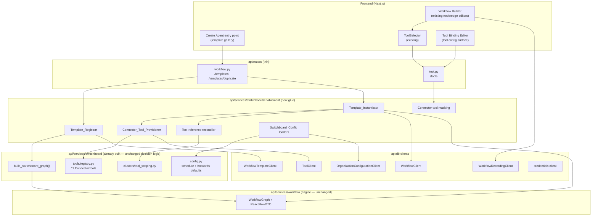
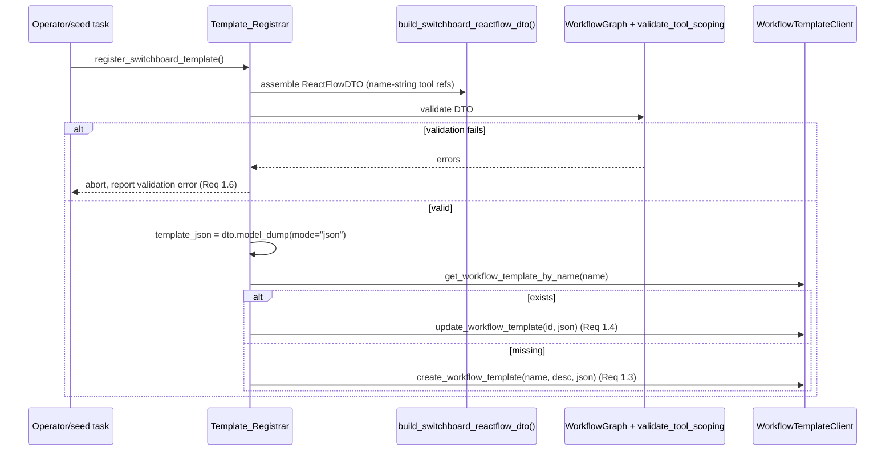

# Design Document

## Overview

The SpinSci AI Virtual Switchboard already exists as a validated workflow graph
assembled by `build_switchboard_graph()` in `api/services/switchboard/`. It is
built entirely from existing engine primitives — `startCall`/`trigger`/`agentNode`/
`endCall`/`globalNode` nodes, edges carrying `condition` + `transition_speech`,
`extraction_variables`, node-scoped `tool_uuids`, `pre_call_fetch_*` on the entry
node, and a config-driven audio greeting. Today that graph is referenced only from
tests: no route, seed, or template makes it creatable, tool-bindable, or
configurable through the product.

This feature is a thin **enablement layer** that closes that gap by reusing seams
that already exist rather than rebuilding any of them:

- the workflow-template catalog (`WorkflowTemplates` model, `WorkflowTemplateClient`,
  `GET /api/v1/workflow/templates`, `POST /api/v1/workflow/templates/duplicate`);
- organization-scoped tools (`ToolModel`, `ToolClient`, `POST/GET/PUT /api/v1/tools`)
  and the node tool-attach UI (`ToolSelector.tsx`);
- the credentials service (`credentials` routes + `webhook_credential_client`);
- workflow recordings (`WorkflowRecordingClient`) and the node recording selector
  (the `recording_ref` property on the `startCall` node spec);
- graph validation (`WorkflowGraph` + `validate_tool_scoping()`); and
- the connector-tool abstraction (`ConnectorTool`, `ConnectorBinding`,
  `ConnectorTool.to_tool_definition()`) that the switchboard already defines.

The layer adds five focused capabilities and **no** new node types, edge fields,
or workflow schema:

1. **Template registration** — serialize the switchboard graph into a
   `template_json` and register it as a create-or-update catalog entry
   (`Template_Registrar`).
2. **Create-agent surfacing** — a "create from template" surface that lists the
   catalog and always offers the switchboard, invoking the existing duplicate path
   (`Create_Agent_UI`).
3. **Organization-scoped instantiation** — an extended instantiation path that
   provisions tools, reconciles graph tool references, regenerates triggers,
   validates, and rolls back atomically on failure (`Template_Instantiator`).
4. **Connector-tool provisioning + binding** — materialize the 11 connector tools
   as bindable, org-scoped `ToolModel` rows and let operators set endpoint /
   credential / field-mapping bindings (`Connector_Tool_Provisioner`,
   `Tool_Binding_Editor`).
5. **Config surface** — make the business-hours schedule/timezone and the
   after-hours hotword list operable through org-scoped configuration, layered over
   the existing `config.py` defaults, preserving the fail-safe empty-hotword and
   America/Chicago behaviors (`Switchboard_Config`).

### Design principles

- **Reuse, do not rebuild.** Every product-facing capability the switchboard needs
  already exists in the engine; the enablement layer only wires the switchboard
  into those seams.
- **Layering (routes → services → db).** New orchestration lives in a dedicated
  `api/services/switchboard/enablement/` package (separate from the switchboard's
  pure decision logic and graph builders). Routes stay thin; DB access stays in
  `db/` clients.
- **Tenant isolation is a hard boundary.** Every instantiated workflow, provisioned
  tool, binding, recording/credential reference, and config record is scoped to a
  single `organization_id`, filtered at the query level, and fails closed to an
  empty result rather than leaking cross-org data.
- **The SpinSci wire contract stays deferred.** Connector tools run on their
  deterministic mock backends until an operator binds an endpoint + credential;
  binding is data on the `ToolModel` definition (`ConnectorBinding`), never
  hardcoded wire formats.

## Architecture

### System context



### Where new code lives

Following the repo layering and the "customer applications get their own service
package" rule, all enablement orchestration lives under a new subpackage so the
switchboard's pure decision logic and graph builders stay untouched:

```
api/services/switchboard/enablement/
├── __init__.py
├── registrar.py        # Template_Registrar: serialize graph -> create-or-update template
├── serialize.py        # ReactFlowDTO extraction from the assembled switchboard graph
├── provisioner.py      # Connector_Tool_Provisioner: 11 tools -> org-scoped ToolModels (idempotent)
├── reconcile.py        # name-string tool_uuids -> real UUIDs; pre_call_fetch binding; scoping preserved
├── instantiator.py     # Template_Instantiator: orchestrate provision->reconcile->validate->persist->rollback
├── scoping.py          # UUID-aware gate-by-scoping validation (fail-closed)
├── masking.py          # mask connector-tool sensitive fields in responses
└── config_source.py    # Switchboard_Config: org-scoped override layer over config.py defaults
```

Routes are extended, not replaced:

- `api/routes/workflow.py` — the existing `POST /api/v1/workflow/templates/duplicate`
  handler delegates to `Template_Instantiator` instead of doing a bare
  `create_workflow`. `GET /api/v1/workflow/templates` is unchanged.
- `api/routes/tool.py` — the tool response builder masks connector-tool sensitive
  fields; the tool update path persists the `ConnectorBinding` (endpoint /
  credential / field mapping) onto the `ToolModel` definition.

DB access continues to run through existing clients (`WorkflowTemplateClient`,
`ToolClient`, `WorkflowClient`/`db_client`, `OrganizationConfigurationClient`,
`WorkflowRecordingClient`, credentials client). One thin serialization seam is
extracted inside the switchboard package (see below) but the graph builders and
decision logic are unchanged.

### Serialization seam (minimal refactor)

`build_switchboard_graph()` today constructs `dto = ReactFlowDTO(nodes, edges)`
internally and returns only the validated `WorkflowGraph` — it discards the DTO.
The `Template_Registrar` needs that DTO to produce `template_json`. The minimal,
behavior-preserving change is to extract the assembly into a
`build_switchboard_reactflow_dto() -> ReactFlowDTO` helper that
`build_switchboard_graph()` then calls (it already builds exactly this object), and
have the registrar serialize `dto.model_dump(mode="json")`. This introduces no new
node type, edge field, or schema — it only exposes the object the assembler already
creates.

### End-to-end flows

**Registration (admin/seed, run once per deployment):**



**Create-agent + instantiation:**

```mermaid
sequenceDiagram
    participant U as User
    participant UI as Create_Agent_UI
    participant API as /workflow/templates(+/duplicate)
    participant Inst as Template_Instantiator
    participant Prov as Connector_Tool_Provisioner
    participant Rec as Reconciler
    participant Val as Graph_Validator
    participant DB as clients (Tool/Workflow)

    U->>UI: open "Create from template"
    UI->>API: GET /workflow/templates
    API-->>UI: templates (Switchboard always shown — Req 2.6)
    U->>UI: select Switchboard + name + confirm
    UI->>API: POST /templates/duplicate {template_id, workflow_name}
    API->>Inst: instantiate(template, org_id, user_id, name)
    Inst->>Prov: provision 11 connector tools (idempotent, org-scoped)
    Prov-->>Inst: {connector_name -> tool_uuid}
    Inst->>Rec: reconcile tool_uuids + pre_call_fetch binding (in memory)
    Inst->>Inst: regenerate trigger UUIDs, stamp organization_id
    Inst->>Val: validate reconciled DTO (WorkflowGraph + gate-by-scoping)
    alt invalid or unresolved tool ref
        Val-->>Inst: error
        Inst->>Inst: roll back tools/bindings/config created this run (Req 3.6)
        Inst-->>API: error (no workflow created)
        API-->>UI: error; stay on create surface (Req 2.5, 2.7)
    else valid
        Inst->>DB: create workflow (org-scoped) + sync triggers
        Inst-->>API: created workflow
        API-->>UI: navigate to Workflow Builder (Req 2.4)
    end
```

The instantiator validates the fully reconciled definition **in memory before**
creating the workflow row, so the common failure path leaves no workflow artifact.
Provisioned tools are created idempotently (reused when already present); any
tool/binding/config row newly created during a failed instantiation is rolled back
by the compensating cleanup described in *Error Handling*.

## Components and Interfaces

### Template_Registrar (`enablement/registrar.py`)

Serializes the assembled switchboard graph into a catalog entry and registers it
create-or-update.

```python
SWITCHBOARD_TEMPLATE_NAME = "spinsci-switchboard"
SWITCHBOARD_TEMPLATE_DESCRIPTION = "SpinSci AI Virtual Switchboard (inbound)."

async def register_switchboard_template(
    template_client: WorkflowTemplateClient | None = None,
) -> WorkflowTemplates:
    """Serialize build_switchboard_reactflow_dto() to template_json and
    create-or-update the catalog entry keyed by SWITCHBOARD_TEMPLATE_NAME.

    Raises SwitchboardTemplateInvalid if the serialized template_json fails
    Graph_Validator validation (Req 1.6)."""
```

Behavior:
- Assemble the `ReactFlowDTO` via the serialization seam; validate it through
  `WorkflowGraph(dto)` and `validate_tool_scoping(dto.nodes)` before writing
  (Req 1.1, 1.6).
- `template_json = dto.model_dump(mode="json")` — preserves node ids, node types,
  edge `condition`/`transition_speech`, `extraction_variables`, and node
  `tool_uuids` name-string references (Req 1.1, 1.5).
- Look up by `template_name`; create when absent (Req 1.3), update the existing row
  when present (Req 1.4). Stable `template_name` + descriptive `template_description`
  (Req 1.2).

Note: `WorkflowTemplates` rows are global (not org-scoped) in the existing schema;
the template holds only the switchboard *shape* with name-string tool references,
no org data. Org scoping is applied at instantiation, not registration.

### Create_Agent_UI (frontend)

A "create from template" entry point added to the existing create-agent surface
(`CreateWorkflowButton` dropdown gains a "From template" item that opens a template
gallery; the gallery is a new presentational surface — it does **not** rebuild the
node/edge builder).

- Lists templates from `GET /api/v1/workflow/templates` (Req 2.1) and renders each
  with `template_name` + `template_description` (Req 2.2).
- **Always** renders the switchboard as a selectable option, even if it is not
  present in the fetched list (e.g. registration hasn't run yet or the fetch
  degraded), rather than hiding it (Req 2.6). Selecting it still routes through the
  duplicate endpoint keyed by the stable switchboard template name/id.
- On confirm, calls `POST /api/v1/workflow/templates/duplicate` with the selected
  template and a user-provided workflow name (Req 2.3).
- On success, navigates to the Workflow Builder for the returned workflow (Req 2.4).
- On failure, shows an error and keeps the user on the create surface; never
  navigates to a partially-created workflow (Req 2.5, 2.7).

### Template_Instantiator (`enablement/instantiator.py`)

The orchestration that turns a selected template into a runnable, org-scoped
switchboard. Invoked by the extended `/templates/duplicate` handler.

```python
async def instantiate_switchboard(
    *,
    template: WorkflowTemplates,
    organization_id: int,
    user_id: int,
    workflow_name: str,
) -> WorkflowModel:
    """Provision connector tools, reconcile tool references + pre_call_fetch,
    regenerate triggers, stamp organization_id, validate, then persist the
    workflow. Rolls back all resources created this run on any failure (Req 3.6)."""
```

Steps and requirement mapping:
1. Provision the 11 connector tools for the org via `Connector_Tool_Provisioner`
   (idempotent) — Req 4.
2. Reconcile the template's name-string `tool_uuids` to the provisioned UUIDs and
   bind the greeting `pre_call_fetch` patient-lookup reference (`reconcile.py`) —
   Req 5.1, 5.2, 5.3. Reject with an unresolved-reference error if any node names a
   tool that was not provisioned (Req 5.4).
3. Regenerate trigger node identifiers (reusing the existing
   `regenerate_trigger_uuids`) so triggers do not collide (Req 3.2).
4. Stamp the new workflow's `organization_id` to the requester's
   `selected_organization_id` (Req 3.1) and scope every created record to it
   (Req 3.5, 13.1).
5. Validate the reconciled `ReactFlowDTO` through the Graph_Validator
   (`WorkflowGraph`) and UUID-aware gate-by-scoping (`scoping.py`) **in memory**
   before persisting (Req 3.3, 3.4, 11.4).
6. Persist the workflow via `db_client.create_workflow(...)` and sync triggers;
   navigate on success.
7. On any failure after partial creation, run the compensating rollback (Req 3.6).

### Connector_Tool_Provisioner (`enablement/provisioner.py`)

Materializes each of the 11 `ConnectorTool`s as an org-scoped `ToolModel`.

```python
CONNECTOR_NAME_KEY = "connector_name"   # stored in definition["switchboard"]

async def provision_connector_tools(
    *, organization_id: int, user_id: int, tool_client: ToolClient
) -> dict[str, str]:
    """Create (or reuse) one org-scoped ToolModel per connector tool.
    Returns {connector_name -> tool_uuid}."""
```

Behavior:
- For each `ConnectorTool` from `get_connector_tools()`, build the definition via
  `ConnectorTool.to_tool_definition()` (Req 4.1), augmented with a stable identity
  marker `definition["switchboard"]["connector_name"] = tool.name`. The definition
  already records `switchboard.clusters` and `switchboard.sensitive_fields`
  (Req 4.3).
- Set `organization_id` to the requester's org and `category = http_api`, `status =
  active` (Req 4.2). Active tools appear automatically in the existing
  `ToolSelector` (Req 4.5).
- **Idempotent identity** = `(organization_id, connector_name)`: before creating,
  look up existing active org tools whose `definition.switchboard.connector_name`
  matches; reuse that `tool_uuid` rather than create a duplicate (Req 4.4).

### Tool-reference reconciler (`enablement/reconcile.py`)

```python
def reconcile_tool_references(
    dto: ReactFlowDTO, name_to_uuid: dict[str, str]
) -> ReactFlowDTO:
    """Replace every node tool_uuids name-string with the org's real tool_uuid,
    and bind the greeting startCall pre_call_fetch patient-lookup reference to the
    provisioned patient_lookup tool. Preserves per-node cluster scoping exactly.
    Raises UnresolvedToolReference if a referenced connector name has no UUID."""
```

Behavior:
- For each node with `tool_uuids`, map each name-string to `name_to_uuid[name]`
  (Req 5.1). The set of tools on a node is exactly the connector tools scoped to
  that node's cluster, so the mapping preserves cluster scoping (Req 5.2).
- Bind the greeting `startCall` node's patient-lookup capability
  (`pre_call_fetch`) to the provisioned `patient_lookup` tool for the org
  (Req 5.3). (`tool_uuids=["patient_lookup"]` on the start node → the real UUID;
  the pre-call fetch URL/credential are supplied by binding, see below.)
- Any name with no provisioned UUID raises `UnresolvedToolReference`, which the
  instantiator surfaces as a rejection (Req 5.4).

### Tool_Binding_Editor + binding persistence (`api/routes/tool.py`, `enablement`)

Operators set a provisioned connector tool's endpoint URL, credential reference,
and field mapping — the `ConnectorBinding` seam — through the existing tool config
surface. The binding is stored on the `ToolModel.definition` under `config`
(`url`, `credential_uuid`, `field_mapping`), exactly the shape
`ConnectorTool.to_tool_definition()` already produces.

- Set endpoint URL, credential reference, and field mapping (Req 6.1, 6.4).
- Credentials resolve through the org-scoped credentials service and are referenced
  by `credential_uuid`, never by raw secret value (Req 6.2, 7.4).
- Persist onto the org-scoped `ToolModel` for that connector via
  `ToolClient.update_tool` (Req 6.5); the update is org-scoped so a foreign
  credential/tool reference is rejected (Req 13.3, 13.4).
- While a connector tool has no configured endpoint, the tool is shown as *unbound*
  and continues to run against its mock backend (Req 6.3, 14.2). When an endpoint +
  credential are configured, invocations route to the configured endpoint using the
  field mapping (Req 14.3); a configured-but-unavailable endpoint fails the
  invocation and does **not** fall back to the mock (Req 14.5).
- If persisting the binding fails, the surface shows an error and does not present
  the save as successful (Req 6.6).

### Connector-tool masking (`enablement/masking.py`)

```python
def mask_connector_tool_definition(definition: dict) -> dict:
    """Return a copy of a connector-tool definition with every value stored under
    a name in definition['switchboard']['sensitive_fields'] masked, and any
    configured credential value masked. Never returns raw secret values."""
```

- Applied by the tool response builder for connector tools so API responses mask
  configured credential values and sensitive-field values (Req 7.1, 7.3).
- Sensitive fields are the tool's declared `sensitive_fields` plus the fixed set
  `phone`, `patient_id`, `provided_dob`, `dob_on_file`, and credential values
  (Req 7.4).
- Enablement logging references sensitive fields by name only and never logs their
  values (Req 7.2), consistent with the existing `ConnectorTool.invoke` logging
  (logs tool name + `bound` flag only).

### Welcome-audio selection (Workflow Builder, reused)

Welcome-audio selection reuses the existing `startCall` node editor: the
`greeting_recording_id` field is a `recording_ref` property and `greeting_type`
selects `audio`. No new UI is built.

- Select an org-scoped recording as the Welcome_Audio for the greeting `startCall`
  node (Req 8.1); this sets `greeting_type='audio'` and `greeting_recording_id`
  (Req 8.2).
- Upload a new org-scoped recording for use as Welcome_Audio via the existing
  recording upload path (Req 8.3).
- While no recording is selected, the builder indicates a welcome recording is
  required before the switchboard is ready to run (Req 8.4) — surfaced as a
  workflow validation/readiness message, not a new schema field.

### Switchboard_Config (`enablement/config_source.py`)

Makes the business-hours schedule/timezone and hotword list operable through
org-scoped configuration, layered over the existing `config.py` defaults.

```python
BUSINESS_HOURS_CONFIG_KEY = "switchboard.business_hours"   # OrganizationConfiguration
HOTWORDS_CONFIG_KEY        = "switchboard.hotwords"

async def load_business_hours(organization_id: int) -> BusinessHoursConfig:
    """Org override -> config.py default (America/Chicago, Mon–Fri 08–17,
    Sat 08–12, Sun closed). (Req 9.1, 9.2, 9.3, 9.4)"""

async def load_hotwords(organization_id: int) -> list[str]:
    """Org override -> env (SWITCHBOARD_AFTERHOURS_HOTWORDS) -> empty list.
    (Req 10.1, 10.2, 10.3)"""
```

- Read at runtime by the after-hours evaluation (Req 9.1, 9.4). The existing
  `config.py` constants/loader remain the default source; the enablement adds an
  org-scoped override layer stored via `OrganizationConfigurationClient` so values
  change without switchboard code changes (Req 9.3, 10.3).
- Defaults preserved: America/Chicago + Mon–Fri 08:00–17:00, Sat 08:00–12:00,
  Sunday closed when nothing is configured (Req 9.2); empty hotword list when
  unconfigured (Req 10.2).
- Fail-safe: an empty/unconfigured hotword list matches nothing and never triggers
  the urgent silent-routing path — the existing `detect_hotword` already returns no
  match for an empty list (Req 10.5); a configured hotword match after hours
  triggers the urgent silent-routing path (Req 10.4).
- Cross-worker: because config edits mutate cached state per worker, propagate
  changes through `WorkerSyncManager` (Redis pub/sub) rather than mutating local
  state (repo multi-worker rule).

### Gate-by-scoping preservation (`enablement/scoping.py`, Workflow Builder)

The transfer gate is enforced structurally by per-node tool scoping.

- `transfer` and `route_metadata_resolution` are attached only to Routing-cluster
  nodes (Req 11.1) — guaranteed at registration by `validate_tool_scoping` on the
  name-string graph.
- At save and at instantiation, a UUID-aware validator confirms no non-Routing node
  lists the `transfer`/`route_metadata_resolution` tool (Req 11.2, 11.4). It
  resolves each node `tool_uuid` back to its connector identity via the provisioned
  `ToolModel` definition marker (`switchboard.connector_name`), then applies the
  existing `ROUTING_ONLY_TOOLS` rule.
- A violation rejects the save/run and reports the gate-by-scoping violation
  (Req 11.3).
- **Fail-closed:** if the validator cannot positively resolve a tool's identity to
  confirm it is not a routing-only tool on a non-routing node, the workflow is
  treated as failing the gate check and the save/run is rejected (Req 11.5).

### Silent-transition / verbatim / global-prompt preservation

These are preserved by faithful serialization + reconciliation (no re-authoring of
speech):
- Serialization uses `model_dump(mode="json")` and reconciliation only rewrites
  `tool_uuids` values, so every edge with empty `transition_speech` stays empty
  (Req 12.1) and the builder persists empty `transition_speech` without substituting
  default text (Req 12.2, reused engine behavior).
- Verbatim node prompts and edge `transition_speech` values are copied unchanged
  (Req 12.3).
- `add_global_prompt=false` on verbatim-emitting nodes is preserved unchanged
  (Req 12.4).

## Data Models

### Reused persistence models (unchanged schema)

**`WorkflowTemplates`** (`workflow_templates`) — global catalog row:

| field | type | notes |
|---|---|---|
| `id` | int PK | |
| `template_name` | str | stable key `spinsci-switchboard` (Req 1.2) |
| `template_description` | str | identifies the SpinSci switchboard |
| `template_json` | JSON | the switchboard `ReactFlow_Definition` (name-string tool refs) |
| `created_at` | datetime | |

**`ToolModel`** (`tools`) — org-scoped provisioned connector tool:

| field | type | notes |
|---|---|---|
| `tool_uuid` | str(36) uuid | referenced by node `tool_uuids` |
| `organization_id` | int FK | tenant scope (Req 4.2, 13.1) |
| `name` | str | connector tool display name |
| `category` | enum | `http_api` |
| `status` | enum | `active` so it lists in `ToolSelector` (Req 4.5) |
| `definition` | JSON | see connector-tool definition below |

**`WorkflowModel` / workflow definition** — the instantiated, org-scoped switchboard
workflow whose `workflow_definition` (ReactFlow JSON) passes `WorkflowGraph`
validation (Req 3.3).

**`OrganizationConfigurationModel`** (`organization_configuration`, key/value,
org-scoped) — holds `switchboard.business_hours` and `switchboard.hotwords`
overrides (Req 9, 10, 13.1).

**`WorkflowRecordingModel`** (org-scoped) — the Welcome_Audio recording referenced
by `greeting_recording_id` (Req 8).

**Webhook/External credential** (org-scoped) — referenced by `credential_uuid` for
connector-tool bindings and pre-call fetch (Req 6.2).

### Connector-tool definition (`ToolModel.definition`)

Produced by `ConnectorTool.to_tool_definition()` and augmented with the identity
marker. Shape:

```json
{
  "schema_version": 1,
  "type": "http_api",
  "config": {
    "url": "",                     // ConnectorBinding.endpoint (empty => unbound => mock)
    "credential_uuid": null,       // ConnectorBinding.credential_key (reference, not secret)
    "field_mapping": {},           // switchboard-field -> backend-field
    "parameters": [ ... ],         // derived from the contract input model
    "timeout_ms": 5000
  },
  "switchboard": {
    "connector_name": "patient_lookup",     // stable identity marker (provisioner)
    "clusters": ["greeting", "authentication"],
    "sensitive_fields": ["phone", "patient_id", "dob_on_file", "name"]
  }
}
```

- `config.url` empty ⇒ unbound ⇒ mock backend (Req 6.3, 14.2). Non-empty +
  `credential_uuid` ⇒ route to endpoint via `field_mapping` (Req 14.3); unavailable
  configured endpoint ⇒ fail, no mock fallback (Req 14.5).
- `switchboard.connector_name` gives the idempotent provisioning identity (Req 4.4)
  and the UUID→identity resolution for gate-by-scoping (Req 11.2, 11.5).
- `switchboard.clusters` records cluster scoping (Req 4.3); `sensitive_fields`
  drives masking (Req 7).

### Tool-reference mapping (in-memory, per instantiation)

```
name_to_uuid: dict[str, str]   # {"patient_lookup": "<uuid>", "transfer": "<uuid>", ...}
```

Produced by the provisioner, consumed by the reconciler. Not persisted; the
persisted artifact is the workflow definition with real UUIDs in every node's
`tool_uuids` and the greeting node's pre-call patient-lookup binding.

### Business-hours config value (`switchboard.business_hours`)

```json
{
  "timezone": "America/Chicago",
  "schedule": {
    "0": ["08:00", "17:00"], "1": ["08:00", "17:00"], "2": ["08:00", "17:00"],
    "3": ["08:00", "17:00"], "4": ["08:00", "17:00"], "5": ["08:00", "12:00"],
    "6": null
  }
}
```

Absent ⇒ the `config.py` defaults apply (Req 9.2). Weekday keys mirror
`datetime.date.weekday()` (Monday=0).

### Hotword config value (`switchboard.hotwords`)

```json
{ "keywords": ["chest pain", "stroke"] }
```

Absent ⇒ env `SWITCHBOARD_AFTERHOURS_HOTWORDS` ⇒ empty list (Req 10.2). Empty ⇒
matches nothing (Req 10.5).

## Correctness Properties

*A property is a characteristic or behavior that should hold true across all valid
executions of a system — essentially, a formal statement about what the system
should do. Properties serve as the bridge between human-readable specifications and
machine-verifiable correctness guarantees.*

The enablement layer is dominated by pure, deterministic transformations over
workflow graphs and tool definitions (serialization, reconciliation, scoping,
masking, org-stamping), which makes property-based testing a strong fit. The
properties below are derived from the prework analysis; UI behaviors, config
plumbing, and external-endpoint behaviors are covered by example/edge/integration
tests in the Testing Strategy instead.

### Property 1: Template serialization round-trip

*For all* nodes and edges in the switchboard graph, serializing the assembled
`ReactFlow_Definition` into `template_json` and loading it back through the
Graph_Validator reconstructs a graph with the same node ids, node types, edge
`condition` values, edge `transition_speech` values, `extraction_variables`, and
node `tool_uuids` references.

**Validates: Requirements 1.1, 1.5**

### Property 2: Template registration idempotence

*For all* integers N ≥ 1, registering the switchboard template N times against a
catalog leaves exactly one switchboard template entry (keyed by the stable
`template_name`) whose `template_json` equals the latest serialization — never a
duplicate.

**Validates: Requirements 1.3, 1.4**

### Property 3: Connector-tool provisioning fidelity and idempotence

*For all* organizations and *for all* integers N ≥ 1, provisioning the connector
tools N times yields exactly one active org-scoped `ToolModel` per connector
identity (11 total), where each `ToolModel` carries the requester's
`organization_id`, a definition equal to that connector's
`ConnectorTool.to_tool_definition()`, and records the connector's cluster scoping
and `sensitive_fields`; repeated provisioning reuses the existing `tool_uuid`s
rather than creating duplicates.

**Validates: Requirements 4.1, 4.2, 4.3, 4.4**

### Property 4: Tool-reference reconciliation completeness

*For all* nodes with `tool_uuids` in the template, after reconciliation every entry
is the real provisioned `tool_uuid` for that org (no connector name-string remains),
the set of tools attached to each node resolves back to exactly the same connector
identities it had before reconciliation (cluster scoping preserved), and the
reconciled `ReactFlow_Definition` passes Graph_Validator validation.

**Validates: Requirements 5.1, 5.2, 3.3**

### Property 5: Trigger identifier freshness

*For all* instantiations of the switchboard template, every trigger node identifier
in the created workflow is freshly minted and differs from the corresponding
identifier in the source template, so no created workflow collides with existing
triggers.

**Validates: Requirements 3.2**

### Property 6: Gate-by-scoping invariant

*For all* switchboard workflows produced or saved by the enablement layer, no
non-Routing node carries the `transfer` or `route_metadata_resolution` tool in its
`tool_uuids`; a workflow that violates this (or whose tool identities cannot be
positively resolved to confirm the invariant) is rejected.

**Validates: Requirements 11.1, 11.2, 11.4**

### Property 7: Speech and prompt preservation

*For all* edges and nodes, serializing and instantiating the switchboard preserves
every empty `transition_speech` as empty (silent transitions stay silent),
preserves every node prompt and edge `transition_speech` value unchanged, and
preserves each node's `add_global_prompt` value unchanged.

**Validates: Requirements 12.1, 12.3, 12.4**

### Property 8: Tenant-isolation invariant

*For all* instantiations by a requesting organization, every record created during
that instantiation (workflow, provisioned `ToolModel`, tool binding, config record,
and any recording/credential reference it writes) carries exactly that
`organization_id`; and *for all* pairs of distinct organizations, an org-scoped
listing or read returns only the requester's records, returning an empty result
rather than any cross-organization record when the organization filter is absent or
fails to apply.

**Validates: Requirements 3.1, 3.5, 4.2, 13.1, 13.2, 13.5**

### Property 9: Instantiation atomic rollback

*For all* failure points injected during instantiation, the set of organization-scoped
records newly created during that instantiation (workflow, provisioned `ToolModel`s,
tool bindings, config records) is empty after the failure — the post-failure state
equals the pre-instantiation state, leaving no partial artifacts.

**Validates: Requirements 3.6**

### Property 10: Binding persistence round-trip

*For all* connector-tool bindings (endpoint URL, credential reference, field
mapping), saving the binding and then reading the org-scoped `ToolModel` back yields
a definition whose `config` reproduces the saved endpoint, credential reference, and
field mapping.

**Validates: Requirements 6.5**

### Property 11: Sensitive-field masking

*For all* connector-tool definitions surfaced in an API response, every value stored
under a declared `sensitive_field` name and every configured credential value is
masked, and credentials are represented by identifier references rather than raw
secret values (the fields `phone`, `patient_id`, `provided_dob`, `dob_on_file`, and
credential values are always treated as sensitive).

**Validates: Requirements 6.2, 7.1, 7.3, 7.4**

### Property 12: Empty hotword list matches nothing

*For all* caller utterances, when the configured Hotword_List is empty or
unconfigured, hotword detection returns no match and the urgent silent-routing path
is not triggered.

**Validates: Requirements 10.5**

## Error Handling

The enablement layer favors validating in memory before persisting, failing closed
on ambiguity, and rolling back atomically so no partial artifacts survive a failure.

### Registration errors

- **Invalid serialized graph (Req 1.6):** the `Template_Registrar` validates the
  assembled `ReactFlowDTO` through `WorkflowGraph` and `validate_tool_scoping`
  before any write. On failure it raises `SwitchboardTemplateInvalid` carrying the
  validation errors and writes nothing to the catalog.

### Instantiation errors and rollback (Req 3.4, 3.6)

- The instantiator provisions tools (idempotent), reconciles references, and
  validates the reconciled `ReactFlowDTO` **in memory** before creating the
  workflow row, so the overwhelmingly common failure path leaves no workflow
  artifact.
- It tracks every organization-scoped row it *newly creates* during the run (the
  workflow id, any `ToolModel` uuids created — not those reused — any binding/config
  rows). On any failure after partial creation it runs a compensating rollback that
  deletes exactly those rows, restoring the pre-instantiation state (Req 3.6). Where
  a single unit-of-work session can span the writes, it is preferred; otherwise
  compensating deletes provide the same all-or-nothing guarantee.
- Validation failure of the created definition (Req 3.4) returns a structured error
  identifying the validation failure (reusing the engine's `WorkflowError` shape
  the existing routes already return as HTTP 422) and rolls back.
- The route surfaces failures as an error response so the `Create_Agent_UI` stays on
  the create surface and never navigates to a partially-created workflow (Req 2.5,
  2.7).

### Unresolved tool reference (Req 5.4)

If a node names a connector tool that was not provisioned for the org, the
reconciler raises `UnresolvedToolReference`; the instantiator rejects the
instantiation, reports the unresolved reference, and rolls back.

### Gate-by-scoping, fail-closed (Req 11.3, 11.5)

Save/instantiation gate validation resolves each node `tool_uuid` to its connector
identity via the provisioned `ToolModel` definition marker. A routing-only tool on a
non-Routing node is rejected with a gate-by-scoping violation. If any tool identity
cannot be positively resolved (e.g. a `tool_uuid` that no longer resolves to a known
connector), the validator treats the workflow as failing the gate and rejects the
save/run rather than allowing it.

### Binding persistence failure (Req 6.6)

If persisting a binding fails, the tool update path returns an error; the
`Tool_Binding_Editor` shows the error and does not present the save as successful.
No partial binding is left on the `ToolModel`.

### Connector-tool invocation (Req 6.3, 14.2, 14.5)

- Unbound (empty endpoint) ⇒ serviced by the deterministic mock backend; surfaced as
  "unbound" in the UI.
- Bound (endpoint + credential configured) ⇒ invocations route to the configured
  endpoint via the field mapping. A configured-but-unavailable endpoint fails the
  invocation and does **not** fall back to the mock backend — the failure is
  propagated to the caller/run.

### Tenant-isolation failures (Req 13.3, 13.4, 13.5)

- A request referencing a tool/recording/credential outside the requester's org is
  rejected with a not-found result (reusing the org-scoped DB clients that already
  filter by `organization_id`).
- Node references to a recording/credential are validated against the workflow's
  `organization_id` before acceptance.
- If the org filter is bypassed or fails to apply, reads return an empty result
  rather than unfiltered cross-org rows (fail-to-empty).

### Config loading (Req 9.2, 10.2)

Missing or malformed org config falls back to the `config.py` defaults (America/
Chicago business hours) and the empty hotword list, preserving fail-safe behavior;
malformed overrides are logged (by key, never secret values) and ignored in favor of
defaults.

## Testing Strategy

A dual approach: property-based tests verify the universal transformations, while
example/edge/integration tests cover UI behavior, config plumbing, error paths, and
external-endpoint behavior.

### Property-based tests

- **Library:** `hypothesis` (already used in this repo — see `.hypothesis/`), run
  under pytest with the test environment sourced (`api/.env.test`).
- **Iterations:** each property test runs a minimum of 100 iterations
  (`@settings(max_examples=100)` or higher).
- **Tagging:** each property test is tagged with a comment referencing its design
  property, in the format
  **Feature: switchboard-frontend-enablement, Property N: {property text}**.
- **One test per property:** each of the 12 correctness properties is implemented by
  a single property-based test.
- **Generators:**
  - Switchboard graph variations: start from the real assembled
    `ReactFlow_Definition` and generate structure-preserving perturbations
    (reordered nodes/edges, added extraction variables, added silent/verbatim
    edges) so round-trip, reconciliation, gate-by-scoping, and speech-preservation
    properties exercise a wide space without inventing new node types.
  - `name_to_uuid` maps and organization ids for reconciliation, provisioning, and
    tenant-isolation properties.
  - Connector-tool definitions with random sensitive-field values and credential
    references for the masking property.
  - Arbitrary caller utterances for the empty-hotword property.
  - Injected failure points (parametrized across instantiation steps) for the
    atomic-rollback property, using in-memory/fake DB clients so 100+ iterations
    stay cheap.
- **Mapping:** Property 1→round-trip; 2→registration idempotence; 3→provisioning
  fidelity/idempotence; 4→reconciliation completeness; 5→trigger freshness;
  6→gate-by-scoping; 7→speech/prompt preservation; 8→tenant isolation; 9→atomic
  rollback; 10→binding round-trip; 11→masking; 12→empty-hotword fail-safe.

### Unit / example tests

- Registration create branch and stable name/description (Req 1.2, 1.3).
- Reconciliation of the greeting `startCall` pre-call patient-lookup binding
  (Req 5.3).
- Welcome-audio selection sets `greeting_type='audio'` + `greeting_recording_id`,
  upload path, and the "recording required" readiness message (Req 8.1–8.4).
- Config defaults: America/Chicago schedule (Req 9.2), empty hotword default
  (Req 10.2), and representative in/after-hours and hotword-match evaluations
  (Req 9.4, 10.4).
- Unbound connector serviced by mock (Req 6.3, 14.2); logging references sensitive
  fields by name only (Req 7.2).

### Edge-case tests

- Registrar aborts on an invalid DTO and writes nothing (Req 1.6).
- Instantiation rejects an invalid reconciled DTO with a validation error and no
  workflow row (Req 3.4).
- Unresolved tool reference rejection (Req 5.4).
- Gate violation on a non-Routing node rejected (Req 11.3); fail-closed rejection on
  unresolvable tool identity (Req 11.5).
- Binding persistence failure surfaces an error, no success (Req 6.6).
- Foreign tool/recording/credential reference rejected with not-found (Req 13.3,
  13.4); configured-but-unavailable endpoint fails with no mock fallback (Req 14.5).

### Integration tests

- Create-agent gallery: fetch + list templates, always-show switchboard fallback,
  confirm → duplicate → navigate, and error/partial-failure paths (Req 2.1–2.7),
  using the real `/workflow/templates` + `/templates/duplicate` routes.
- Provisioned active tools appear in `ToolSelector` (Req 4.5).
- Bound connector routes to a mock HTTP endpoint using the field mapping (Req 14.3),
  with 1–3 representative examples (external-endpoint behavior, not property-tested).

### Smoke tests

- Config plumbing reads schedule/timezone and hotwords from the config source
  (Req 9.1, 10.1) and can be changed via org config without code edits (Req 9.3,
  10.3, 14.1, 14.4).

### Constraints observed by all tests

- Async throughout; tests source `api/.env.test` so they never touch dev/prod
  credentials.
- No new node types, edge fields, or workflow schema are introduced; graph
  generators only perturb existing primitives.
- Tenant isolation is asserted at the query level (org-scoped clients), never
  filtered in Python after the fact.
