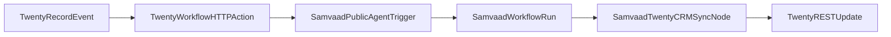

Samvaad integrates with [Twenty CRM](https://github.com/twentyhq/twenty) through a **loosely coupled HTTP contract**. Twenty can trigger individual outbound calls, or Twenty records can be loaded into a Samvaad campaign queue and called one by one. Samvaad executes the voice agent and sends call outcomes back to Twenty. Neither system embeds the other's code, so you can upgrade Twenty releases independently.

---

## Architecture

| Direction | Mechanism | Samvaad surface |
|---|---|---|
| Twenty → Samvaad | Twenty Workflow HTTP Request action | `POST /api/v1/public/agent/{uuid}` |
| Twenty records → Samvaad queue | Native Twenty campaign source (or CSV export) | Samvaad campaigns + `queued_runs` |
| Samvaad → Twenty | Native Twenty CRM Sync node after call completion (or webhook) | Twenty REST API (PATCH record + optional note) |

---

## Prerequisites

1. **Samvaad**
   - Published voice agent with an [API Trigger node](/voice-agent/api-trigger)
   - Org [API key](/configurations/api-keys)
   - Configured [telephony provider](/integrations/telephony/overview)

2. **Twenty** (self-hosted)
   - Workflow with Record trigger and HTTP Request action
   - API key or OAuth token for Samvaad → Twenty post-call updates
   - Custom fields on your target object for call status, recording URL, and transcript URL (recommended)

---

## Quick start

1. For single-record calls, copy the API Trigger UUID from your Samvaad agent and create a Twenty workflow: **Record trigger** → **HTTP Request** to Samvaad.
2. For queued calling, export or sync Twenty people/opportunities into a Samvaad campaign and set campaign concurrency to `1`.
3. Add a Samvaad **Twenty CRM Sync node** (or webhook node) that writes the call outcome back to the Twenty record after each call.
4. Test with a single record or small campaign before enabling automation broadly.

Detailed setup:

- [Integration contracts](/integrations/twenty/contracts) — request/response schemas and error semantics
- [Twenty workflow setup](/integrations/twenty/workflow-setup) — trigger configuration
- [Queued calling](/integrations/twenty/queued-calling) — call CRM records one by one through Samvaad campaigns
- [Post-call sync](/integrations/twenty/post-call-sync) — Twenty CRM Sync node, webhook, and Twenty API mapping
- [Reliability](/integrations/twenty/reliability) — idempotency, retries, and monitoring
- [Upgrade playbook](/integrations/twenty/upgrade-playbook) — Twenty release compatibility
- [BDR feature backlog](/integrations/twenty/bdr-feature-backlog) — later-stage features from the bdr-calling reference implementation

---

## Design principles

- **Contract-first**: Both sides speak versioned JSON over HTTP; no shared libraries required.
- **Idempotent triggers**: Duplicate Twenty workflow deliveries must not place duplicate calls.
- **Correlation IDs**: Pass Twenty record and event IDs in `initial_context` for end-to-end traceability.
- **Configurable mapping**: Field mapping lives in Twenty workflow config and Samvaad webhook templates, not in Samvaad core code.
