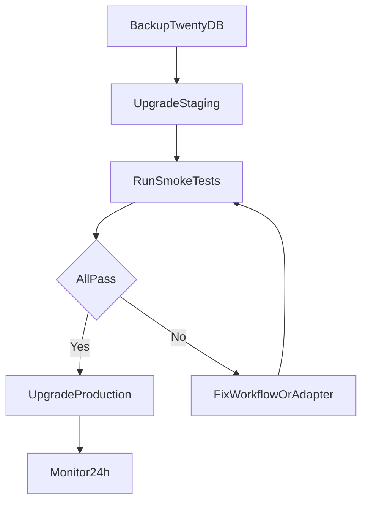

Twenty releases frequently. Because this integration is **HTTP-contract based**, Samvaad does not need redeployment for most Twenty upgrades. Validate the contract boundary instead.

---

## Supported Twenty deployment

This integration targets **self-hosted Twenty**. Test against a pinned version before production upgrades.

Track tested versions in your internal runbook:

| Twenty version | Samvaad contract | Tested date | Notes |
|---|---|---|---|
| e.g. `v2.8.0` | `1.0` | YYYY-MM-DD | Initial integration |

---

## Pre-upgrade checklist

Complete in a **staging** Twenty instance before touching production:

### 1. Workflow trigger smoke test

- [ ] Record trigger still fires on target object
- [ ] HTTP Request action variable syntax unchanged (`{{trigger.record.id}}`, etc.)
- [ ] Secrets / env vars still resolve for `X-API-Key`
- [ ] Idempotency header reaches Samvaad unchanged

### 2. Samvaad trigger contract

- [ ] `POST /api/v1/public/agent/{uuid}` returns `200`
- [ ] `X-Idempotency-Key` returns `duplicate` on replay
- [ ] `initial_context` fields arrive in Samvaad run detail

### 3. Post-call sync contract

- [ ] Webhook node still reaches Twenty API (or middleware)
- [ ] PATCH/update succeeds with current field names
- [ ] Duplicate webhook delivery is idempotent on Twenty side

### 4. API compatibility

- [ ] Twenty REST auth method unchanged (API key / OAuth)
- [ ] Object and field API names unchanged (check metadata API)
- [ ] Rate limits still sufficient (Twenty documents 100 req/min)

---

## Upgrade procedure



1. **Backup** Twenty database and export active workflow definitions.
2. **Upgrade staging** following [Twenty's upgrade guide](https://docs.twenty.com/developers/self-host/capabilities/upgrade-guide).
3. **Run smoke tests** from the checklist above.
4. **Upgrade production** during a low-traffic window.
5. **Monitor** trigger success rate and webhook delivery for 24 hours.

---

## Rollback options

Rollback does **not** require Samvaad changes.

| Scenario | Rollback action |
|---|---|
| Workflow behavior broken | Revert to previous Twenty workflow version |
| Twenty app regression | Restore DB backup; redeploy previous Twenty image tag |
| Field mapping broken | Disable workflow; fix webhook template; re-enable |
| Samvaad trigger issues | Disable Twenty workflow only — Samvaad unchanged |

Keep the previous Twenty workflow version **active but disabled** until the new version is validated.

---

## Breaking change watchlist

Monitor Twenty release notes for changes affecting:

- Workflow trigger variables and HTTP Request action
- REST API object/field naming
- Authentication (API keys, OAuth scopes)
- Webhook signature format (if you ingest Twenty webhooks later)
- Self-host upgrade migration steps

Sources:

- [Twenty releases](https://github.com/twentyhq/twenty/releases)
- [Twenty workflow docs](https://docs.twenty.com/user-guide/workflows/capabilities/workflow-actions)
- [Twenty API docs](https://docs.twenty.com/developers/extend/api)

---

## Contract versioning policy

| Contract version | Change type | Action |
|---|---|---|
| Patch (e.g. new optional field) | Backward compatible | Document only |
| Minor (e.g. new response field) | Backward compatible | Update docs |
| Major (e.g. endpoint rename) | Breaking | Bump `integration_contract_version`; support old version for deprecation window |

Samvaad exposes `integration_contract_version` in trigger responses. External adapters should log and validate this field.

---

## Post-upgrade validation script

Minimal manual validation after each upgrade:

```bash
# 1. Trigger test call (replace placeholders)
curl -sS -X POST "https://samvaad.example.com/api/v1/public/agent/{TRIGGER_UUID}" \
  -H "Content-Type: application/json" \
  -H "X-API-Key: ${SAMVAAD_API_KEY}" \
  -H "X-Idempotency-Key: upgrade-test-$(date +%s)" \
  -H "X-Correlation-Id: upgrade-test-$(date +%s)" \
  -d '{
    "phone_number": "+15555550100",
    "initial_context": {
      "twenty_object": "person",
      "twenty_record_id": "test-record-id",
      "twenty_event_id": "upgrade-test"
    }
  }'

# 2. Confirm response contains integration_contract_version: "1.0"
# 3. Replay same X-Idempotency-Key — expect status: duplicate
# 4. Complete call in staging and verify Twenty record update
```

Store results in your version compatibility table.
